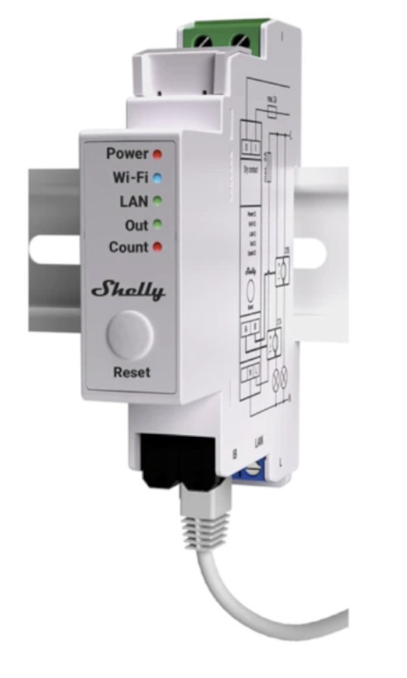
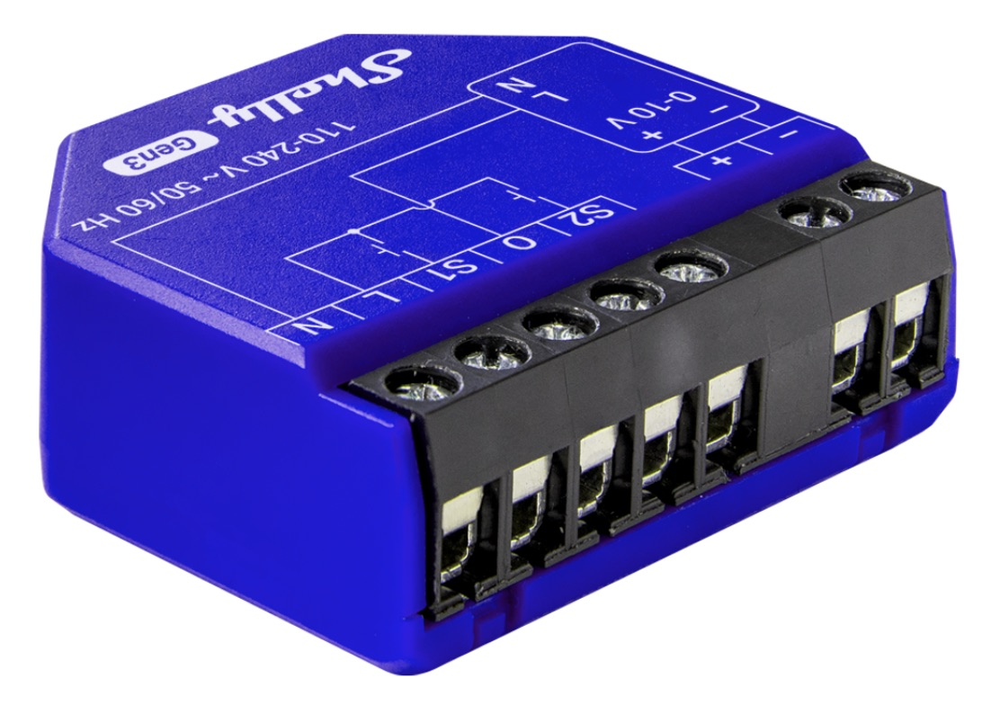
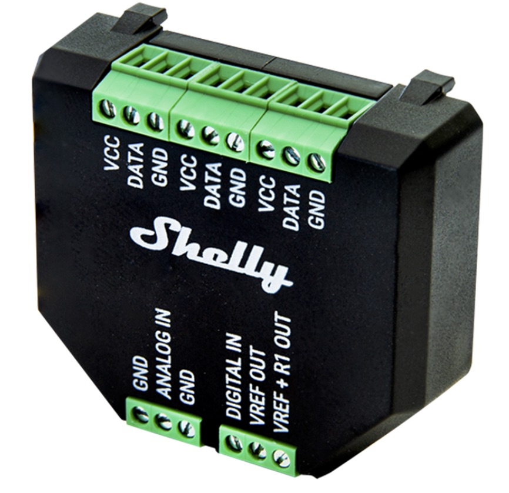
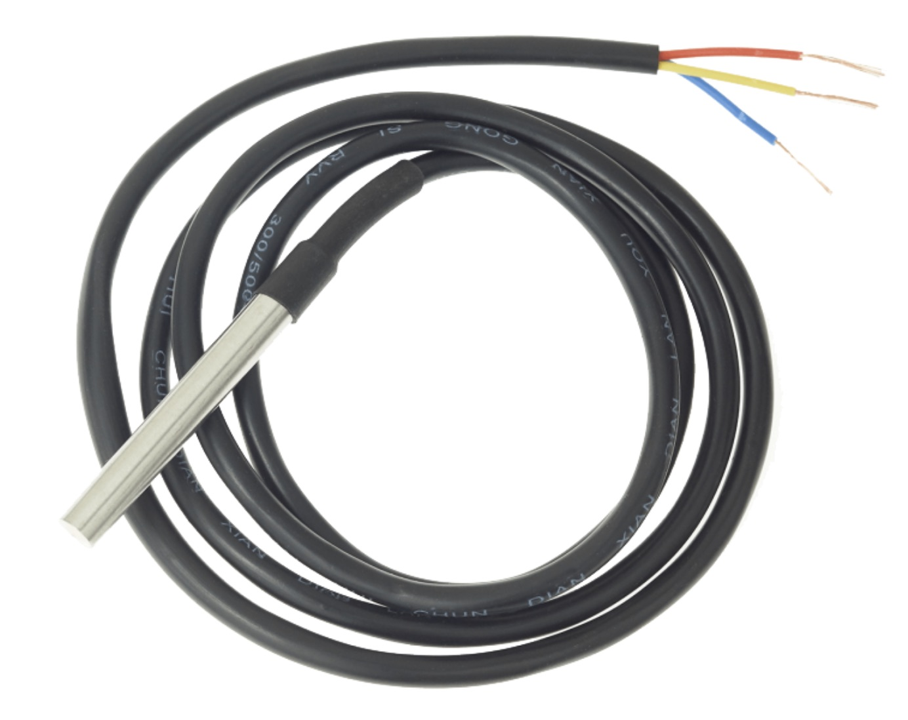
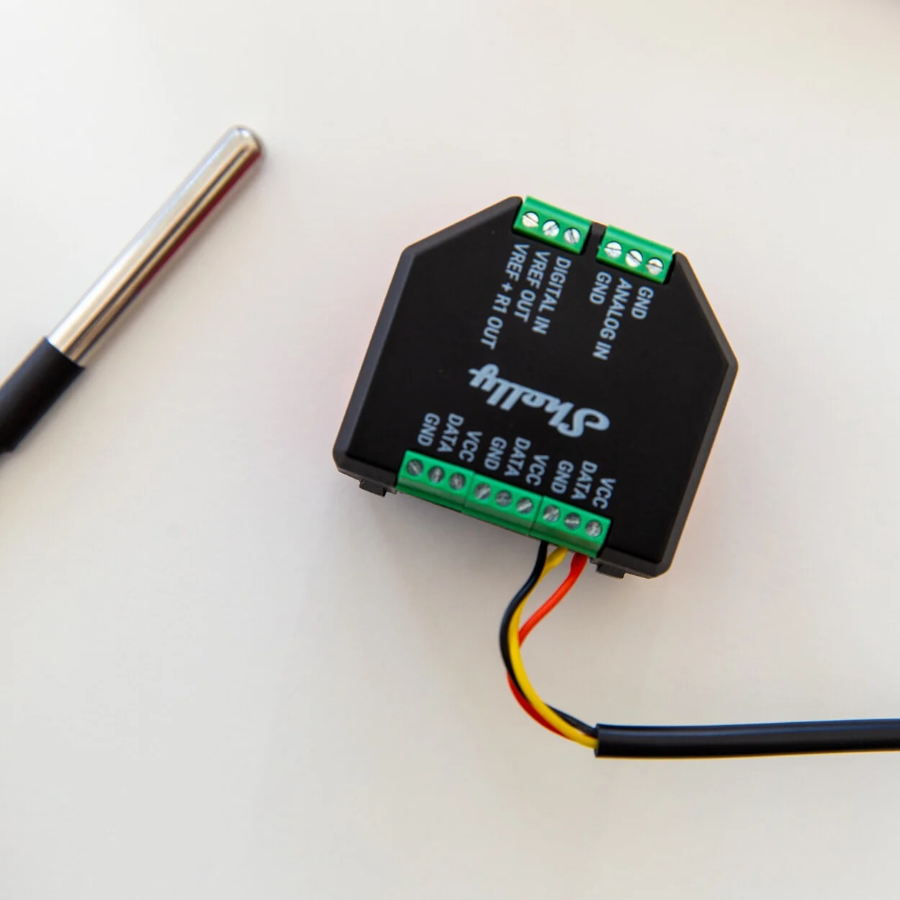
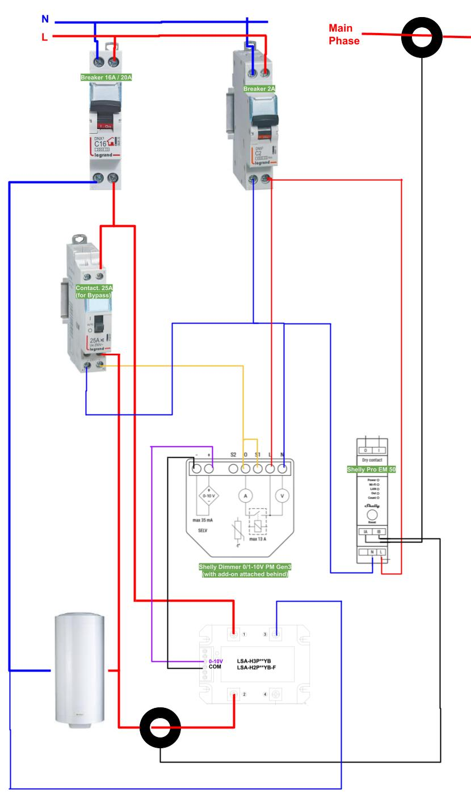

_Date: TBD_

# Shelly Solar Diverter

## What is a Solar Router / Diverter ?

A _Solar Router_ allows to redirect the solar production excess to some appliances instead of returning it to the grid.
The particularity of a solar router is that it will dim the voltage and power sent to the appliance in order to match the excess production, in contrary to a simple relay that would just switch on/off the appliance without controlling its power.

A _Solar Router_ is usually connected to the resistance of a water tank and will heat the water when there is production excess.

A solar router can also do more things, like controlling (on/off) the activation of other appliances (with the grid normal voltage and not the dimmed voltage) in case the excess reaches a threshold. For example, one could activate a pump, pool heater, etc if the excess goes above a specific amount, so that this appliance gets the priority over heating the water tank.

A router can also schedule some forced heating of the water tank to ensure the water reaches a safe temperature, and consequently bypass the dimmed voltage. This is called a bypass relay.

## Shelly Solar Router

This solar diverter based on Shelly can control remotely dimmers and could even be enhanced with relays.
Shelly's being remotely controllable, such system offers a very good integration with Shelly App and Home Automation Systems like Home Assistant.

It is possible to put some rules based on temperature, time, days, etc and control everything.

A shelly script will be setup to activate an automatic mode where the Shelly's will automatically adjust themselves according to the grid import or export (solar production excess)

## Download

- **[Shelly Solar Diverter Script](/blog/downloads/solar_diverter.js)**

## Hardware

All the components can be bought at [https://www.shelly.com/](https://www.shelly.com/), except the voltage regulator, where you can find some links [on this website](https://yasolr.carbou.me/build#compatible-hardware)

| [Shelly Pro EM - 50](https://www.shelly.com/fr/products/shop/proem-1x50a) | [Shelly Dimmer 0/1-10V PM Gen3](https://www.shelly.com/fr/products/shop/1xsd10pmgen3) | [Shelly Plus Add-On](https://www.shelly.com/fr/products/shop/shelly-plus-add-on) | [Temperature Sensor DS18B20](https://www.shelly.com/fr/products/shop/temperature-sensor-ds18B20) | [Loncont LSA-H3P50YB](https://fr.aliexpress.com/item/32606780994.html) |
| :-----------------------------------------------------------------------: | :-----------------------------------------------------------------------------------: | :------------------------------------------------------------------------------: | :----------------------------------------------------------------------------------------------: | :--------------------------------------------------------------------: |
|                          |                                     |                                     |                                                      |                            |

Some additional hardware are required depending on the installation.
Please select the amperage according to your needs.

- A 2A breaker for the Shelly electric circuit
- A 16A or 20A breaker for your water tank (resistance) electric circuit
- A 25A relay or contactor for the bypass relay (to force a heating) for the water tank electric circuit
- A protection box for the Shelly

## Wiring

### Shelly Add-On + DS18B20

First the easy part: the temperature sensor and the Shelly Add-On, which has to be put behind the Shelly Dimmer.

### Electric Circuit

- Choose your breakers and wires according to your load
- Circuits can be split.
  For example, the Shelly EM can be inside the main electric box, and the Shelly Dimmer + Add-On can be in the water tank electric panel, while the contactor and dimmer can be placed neat the water tank.
  They communicate through the network.
- The dimmer will control the voltage regulator through the `COM` and `0-10V` ports
- The dimmer will also control the relay or contactor through the `A2` ports
- The wire from `Dimmer Output` to `Dimmer S1` is to set the switch mode to invert and make the dimmer detect when the contactor is OFF or ON and respectively disable or enable the dimming.
- The B clamp around the wire going from the voltage regulator to the water tank is to measure the current going through the water tank resistance is optional and for information purposes only.
- The A clamp should be put around the main phase entering the house
- The relay / contactor is optional and is used to schedule some forced heating of the water tank to ensure the water reaches a safe temperature, and consequently bypass the dimmed voltage.
- The neutral wire going to the voltage regulator can be a small one; it is only used for the voltage and Zero-Crossing detection.

### RC Snubber

If switching the contactor / relay causes the Shelly device to reboot, place a [RC Snubber](https://www.shelly.com/fr/products/shop/shelly-rc-snubber) between the A1 and A2 ports of the contactor / relay.

### Add a second dimmer

If you want to control a second resistive load, it is possible to duplicate the circuit to add another dimmer and voltage regulator.

## Shelly Setup

First make sure that your Shelly's are setup properly.

The program has to be installed inside the Shelly Pro EM 50, because this is where the measurements of the imported and exported grid power is done.
Also, this central place allows to control the 1, 2 or more dimmers remotely.

### Shelly Pro EM 50 Setup

- Make sure to place the A clamp around the main phase entering the house
- Upload the `Shelly Solar Diverter` script (at the end of this page)

### Shelly Dimmer Setup

- Make sure the switch (input) are enabled and inverted. S1 should replicate the inverse state of the relay / contactor.
- Setup the switch to automatically stop the dimmer when turned off
