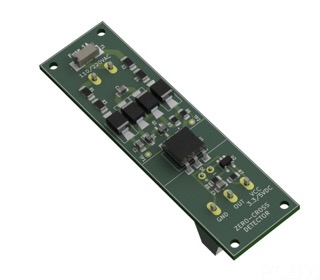
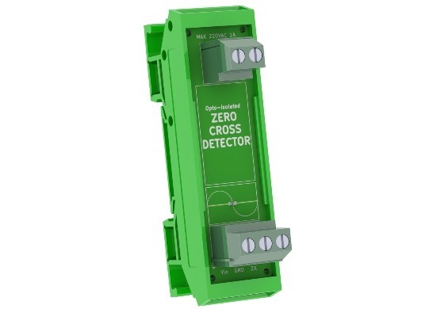
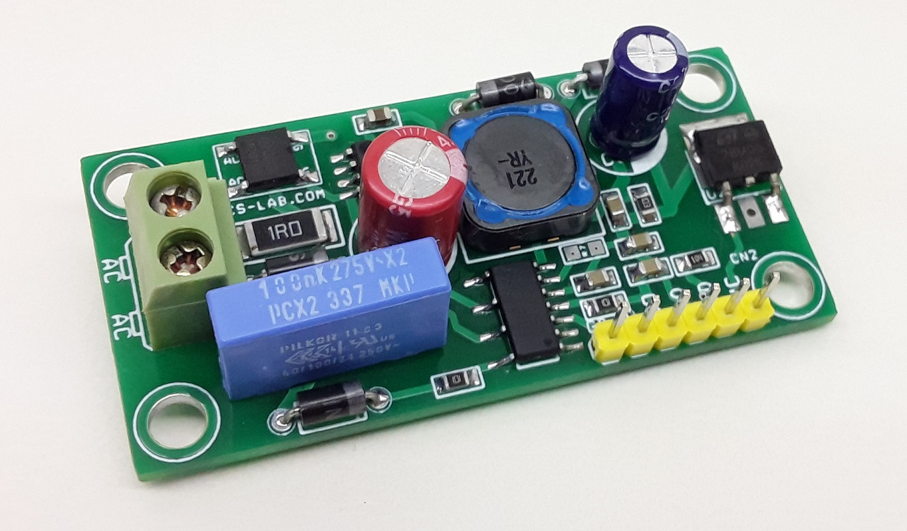

# Buy YaSolR Pro

OSS and Pro firmware are the same, except that the PRO version relies on commercial (paid) libraries and provides some additional features based on a better dashboard.

**The Pro version is only 20 euros** and gives access to all the perks of the Pro version below:

| Feature                    |                            OSS (Free)                            |                                                                                              PRO (Paid)                                                                                              |
| -------------------------- | :--------------------------------------------------------------: | :--------------------------------------------------------------------------------------------------------------------------------------------------------------------------------------------------: |
| Dashboard                  |                        Overview **only**                         |                                                                              Full Dashboard as seen in the screenshots                                                                               |
| Configuration              |                        Debug Config Page                         |                                                                               **From Dashboard** Debug Config Page                                                                                |
| Energy Reset               |                                ❌                                |                                                                                                  ✅                                                                                                  |
| GPIO Config and Health     |                                ❌                                |                                                                                                  ✅                                                                                                  |
| Hardware Config and Health |                                ❌                                |                                                                                                  ✅                                                                                                  |
| Output Statistics          |                                ❌                                |                                                                                                  ✅                                                                                                  |
| PID Tuning View            |                                ❌                                |                                                                                                  ✅                                                                                                  |
| Help & Support             |     [Facebook Group](https://www.facebook.com/groups/yasolr)     | [Facebook Group](https://www.facebook.com/groups/yasolr)   [Forum](https://github.com/mathieucarbou/YaSolR/discussions)   [Bug Report](https://github.com/mathieucarbou/YaSolR/issues) |
| Web Console                | [WebSerial Lite](https://github.com/mathieucarbou/WebSerialLite) |                                                                              [WebSerial Pro](https://www.webserial.pro)                                                                              |
| Dashboard                  |      [ESP-DASH](https://github.com/ayushsharma82/ESP-DASH)       |                                                                                 [ESP-DASH Pro](https://espdash.pro)                                                                                  |
| OTA Firmware Update        |    [ElegantOTA](https://github.com/ayushsharma82/ElegantOTA)     |                                                                               [ElegantOTA Pro](https://elegantota.pro)                                                                               |

The money helps funding the hardware necessary to test and develop the firmware.

## How to buy:

1. Get a **[Github](https://github.com/)** account so that I can add your GitHub username to the project repository from where you can download all the firmware files.

2. Make a donation of **20 euros or more** (through [Github](https://github.com/sponsors/mathieucarbou) or [Paypal](https://www.paypal.com/donate/?hosted_button_id=QJYRAPXGEDCNS)).
   Any sponsoring of 20 euros or more will give access to the **Pro version and all the upcoming updates for an unlimited time**!

> ##### IMPORTANT
>
> - Github is the preferred way to sponsor
> - If you prefer Paypal, do not forget to add your GitHub username in the Paypal form (there will be a comment / note field for that).
>   {: .block-important }

Thanks a lot!

# Hardware

## Zero-cross Detection modules

I sometimes order batches of Zero-cross Detection modules from PCbWay for my testing and I have spare ones to resell at cost price.
If you are interested, please contact me.

Here is below the availabilities:

| **Module Picture (from author)**                                            | **Module Link**                                                                                                                      | **Price** | **Availability** |
| :-------------------------------------------------------------------------- | :----------------------------------------------------------------------------------------------------------------------------------- | :-------: | :--------------: |
|  | [ZCD module from Daniel S.](https://www.pcbway.com/project/shareproject/Zero_Cross_Detector_a707a878.html) (no enclosure)            |   10 €    |        6         |
|               | [ZCD module from Daniel S.](https://www.pcbway.com/project/shareproject/Zero_Cross_Detector_a707a878.html) (with DIN Rail enclosure) |   25 €    |        6         |
|             | [ZCD module from Rajkumar S](https://www.electronics-lab.com/project/ac-voltage-zero-cross-detector/) (no enclosure)                 |   25 €    |        7         |

The price difference accounts for the quality, accuracy and features of these ZCD modules (see the author's pages for more details).

**Shipping fees are not included in the price.**

# Sponsoring

Any sponsoring is greatly appreciated to help me continue working in this project and all other project I maintain (see [all the Open-Source projects and Arduino / ESP32 libraries I have created](https://oss.carbou.me)).

Here are 2 ways to sponsor:

| **[Using GitHub](https://github.com/sponsors/mathieucarbou)   (Preferred way)** | **[Using Paypal](https://www.paypal.com/donate/?hosted_button_id=QJYRAPXGEDCNS)** |
| :--------------------------------------------------------------------------------: | :-------------------------------------------------------------------------------: |
|                   |                  |
