# YaS☀️lR Manual

- [Quick Start](#quick-start)
  - [Initial Firmware Installation](#initial-firmware-installation)
  - [Captive Portal (Access Point) and WiFi](#captive-portal-access-point-and-wifi)
  - [Access Point Mode](#access-point-mode)
- [YaS☀️lR Pages](#yas%E2%98%80%EF%B8%8Flr-pages)
  - [`/config`](#config)
  - [`/console`](#console)
  - [`/update`](#update)
- [Dashboard / Overview](#dashboard--overview)
- [Dashboard / Output 1 & 2](#dashboard--output-1--2)
- [Dashboard / Relays](#dashboard--relays)
- [Dashboard / Management](#dashboard--management)
- [Dashboard / Network](#dashboard--network)
- [Dashboard / MQTT](#dashboard--mqtt)
  - [MQTT as a Grid Source](#mqtt-as-a-grid-source)
  - [Home Assistant Discovery](#home-assistant-discovery)
- [Dashboard / GPIO](#dashboard--gpio)
- [Dashboard / Hardware](#dashboard--hardware)
- [Dashboard / Hardware Config](#dashboard--hardware-config)
  - [Resistance Calibration](#resistance-calibration)
- [Dashboard / Statistics](#dashboard--statistics)
- [Important Hardware Information](#important-hardware-information)
  - [Bypass Relay](#bypass-relay)
  - [Display](#display)
  - [JSY-MK-194T](#jsy-mk-194t)
    - [Remote JSY](#remote-jsy)
  - [LEDs](#leds)
  - [PZEM-004T V3](#pzem-004t-v3)
    - [Pairing procedure](#pairing-procedure)
  - [Temperature Sensor](#temperature-sensor)
  - [Zero-Cross Detection](#zero-cross-detection)
  - [Compatibility with EV box like OpenEVSE](#compatibility-with-ev-box-like-openevse)
- [Help and support](#help-and-support)

## Quick Start

When everything is wired and installed properly, you can:

1.  Flash the downloaded firmware (see [Initial Firmware Installation](#initial-firmware-installation))
2.  Power on the system to start the application
3.  Connect to the WiFI: `YaSolR-xxxxxx`
4.  Connected to the Captive Portal to setup your WiFi (see: [Captive Portal (Access Point) and WiFi](#captive-portal-access-point-and-wifi))
5.  Go to the [Dashboard / GPIO](#dashboard--gpio) page to verify your GPIOs.
6.  Go to the [Dashboard / Hardware](#dashboard--hardware) page to activate the hardware you have
7.  Go to the [Dashboard / Hardware Config](#dashboard--hardware-config) page to configure your hardware settings and resistance values if needed.
    [Resistance Calibration](#resistance-calibration) is really important to do otherwise the router will not work.
8.  Go to the [Dashboard / MQTT](#dashboard--mqtt) page to configure your MQTT settings if needed.
9.  Go to the [Dashboard / Relays](#dashboard--relays) page to configure your relay loads if needed.
10. Go to [Dashboard / Output 1 & 2](#dashboard--output-1--2) pages to configure your bypass options and dimmer settings if needed.
11. Restart to activate everything.
12. Enjoy your YaS☀️lR!

### Initial Firmware Installation

The firmware file which must be used for a first installation is the one ending with `.FACTORY.bin`:

Firmware can be downloaded here : [](https://yasolr.carbou.me/download)

Flash with `esptool.py` (Linux / MacOS):

```bash
# Erase the memory (including the user data)
esptool.py \
  --port /dev/ttyUSB0 \
  erase_flash
```

```bash
# Flash initial firmware and partitions
esptool.py \
  --port /dev/ttyUSB0 \
  --chip esp32 \
  --before default_reset \
  --after hard_reset \
  write_flash \
  --flash_mode dout \
  --flash_freq 40m \
  --flash_size detect \
  0x0 YaSolR-VERSION-MODEL-CHIP.FACTORY.bin
```

Do not forget to change the port `/dev/ttyUSB0` to the one matching your system.
For example on Mac, it is often `/dev/cu.usbserial-0001` instead of `/dev/ttyUSB0`.

With [Espressif Flash Tool](https://www.espressif.com/en/support/download/other-tools) (Windows):

**Be careful to not forget the `0`.**

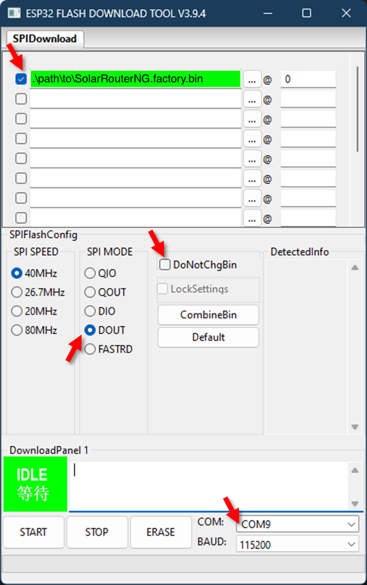

### Captive Portal (Access Point) and WiFi

> Captive Portal and Access Point address: [http://192.168.4.1/](http://192.168.4.1/)

A captive portal (Access Point) is started for the first time to configure the WiFi network, or when the application starts and cannot join an already configured WiFi network fro 15 seconds.

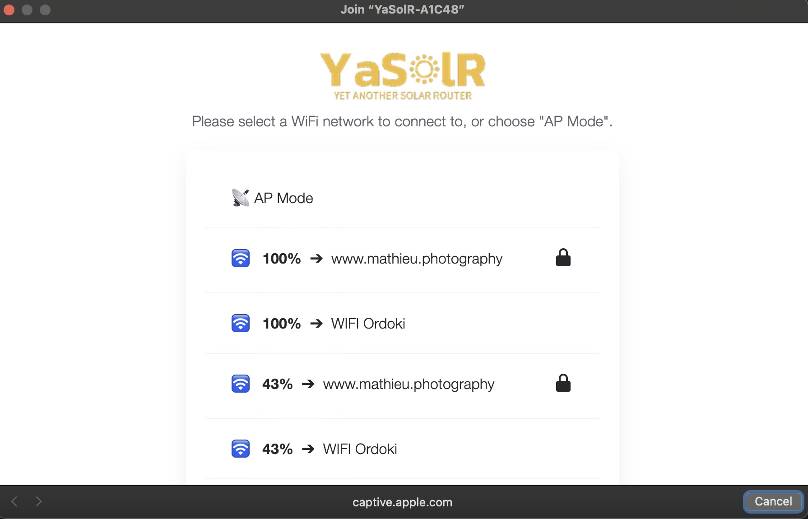

The captive portal is only started for 3 minutes, to allow configuring a (new) WiFi network.
After this delay, the portal will close, and the application will try to connect again to the WiFi.
And again, if the WiFi cannot be reached, connected to, or is not configured, the portal will be started again.

This behavior allows to still have access to the application in case of a WiFi network change, or after a power failure, when the application restarts.
If the application restarts before the WiFi is available, it will launch the portal for 3 minutes, then restart and try to join the network again.

In case of WiFi disruption (WiFi temporary down), the application will keep trying to reconnect.
If it is restarted and the WiFi is still not available, the Captive Portal will be launched.

### Access Point Mode

You can also chose to not connect to your Home WiFi and keep the AP mode active.
In this case, you will need to connect to the router WiFi each time you want to access it.

In AP mode, all the features depending on Internet access and time are not available (MQTT, NTP).
You will have to manually sync the time from your browser to activate the auto bypass feature.

## YaS☀️lR Pages

Here are the main links to know about in the application:

- `http://yasolr.local/`: Dashboard
- `http://yasolr.local/console`: Web Console
- `http://yasolr.local/update`: Web OTA (firmware update)
- `http://yasolr.local/config`: Debug Configuration Page
- `http://yasolr.local/api`: [REST API](rest)

_(replace `yasolr.local` with the IP address of the router)_

### `/config`

This page is accessible at: `http://<esp-ip>/config`.
It allows to see the raw current configuration of the router and edit it.
This page should not normally be used, except for debugging purposes.

[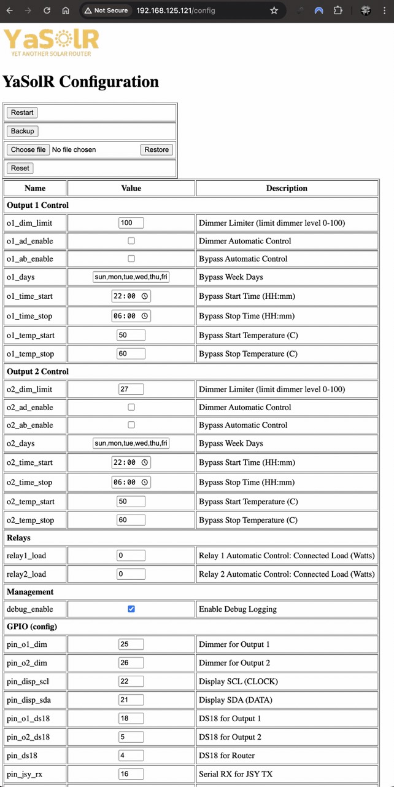](assets/img/screenshots/config.jpeg)

### `/console`

A Web Console is accessible at: `http://<esp-ip>/console`.
You can see more logs if you activate Debug logging (but it will make the router react a bit more slowly).

[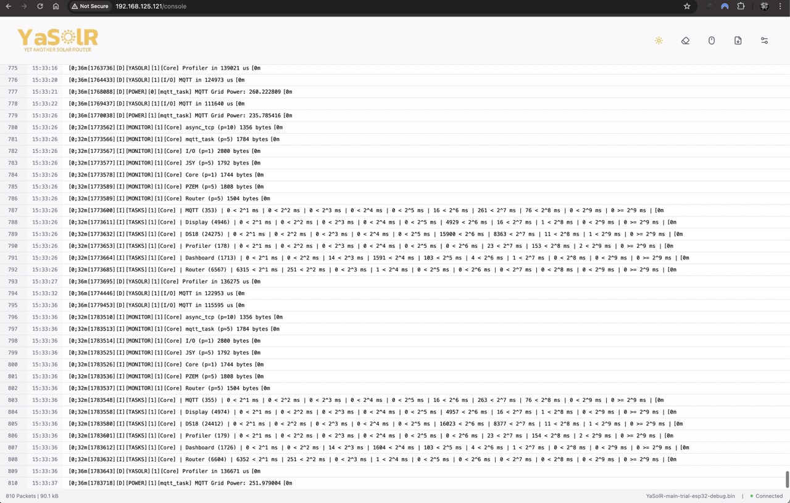](assets/img/screenshots/console.jpeg)

### `/update`

Go to the Web OTA at `http://<esp-ip>/update` to update the firmware over the air:

[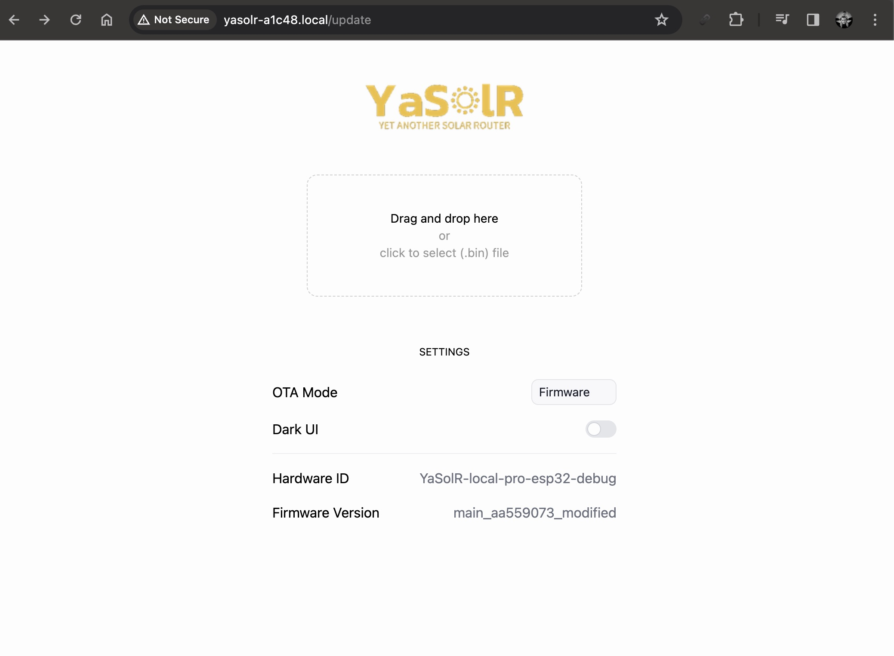](assets/img/screenshots/update.jpeg)

The firmware file which must be used is the one ending with `.UPDATE.bin`:

`YaSolR-<VERSION>-<MODEL>-<BOARD>.UPDATE.bin`

## Dashboard / Overview

The overview section shows some global information about the router.

[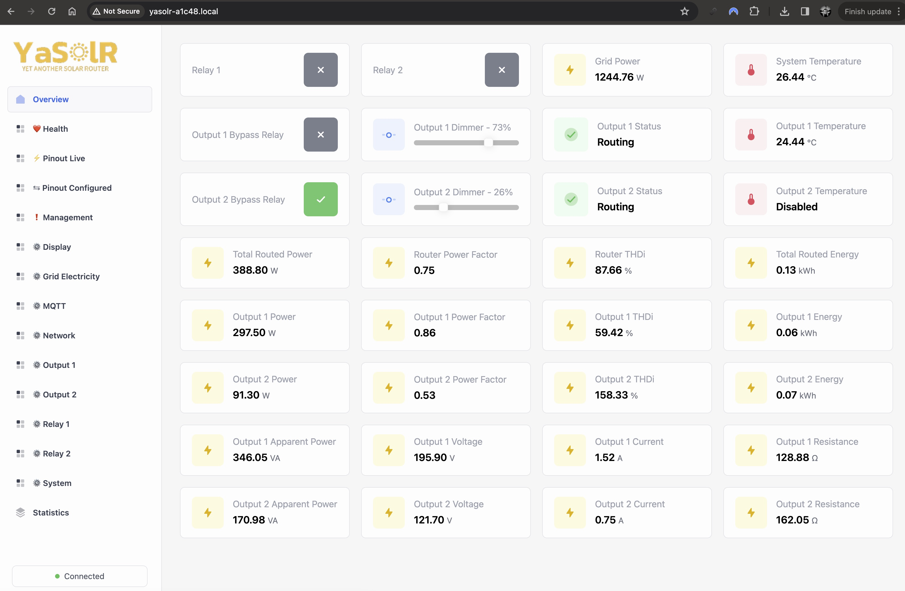](assets/img/screenshots/overview.jpeg)

The temperature is coming from the sensor installed in the router box.

## Dashboard / Output 1 & 2

The output sections show the state of the outputs and the possibility to control them.

| [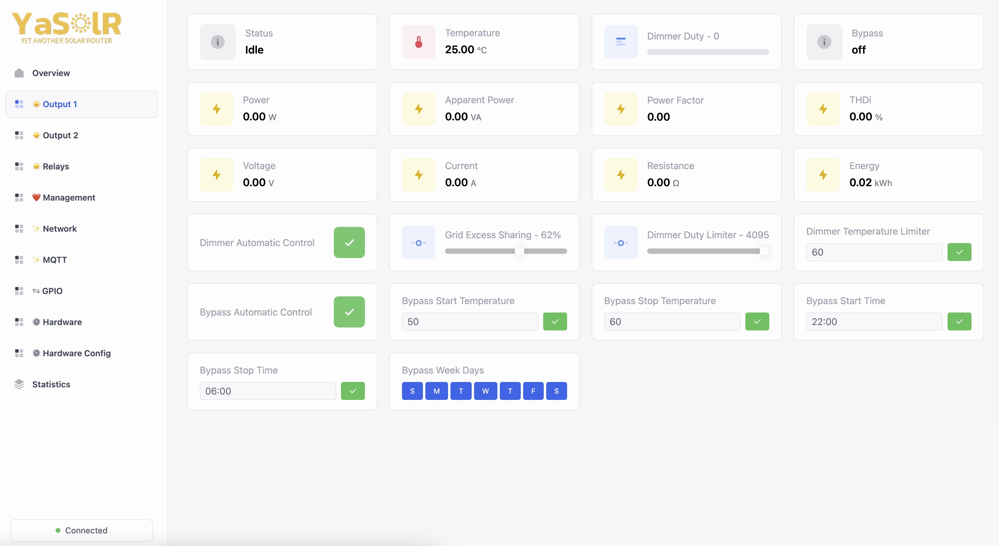](assets/img/screenshots/output1.jpeg) | [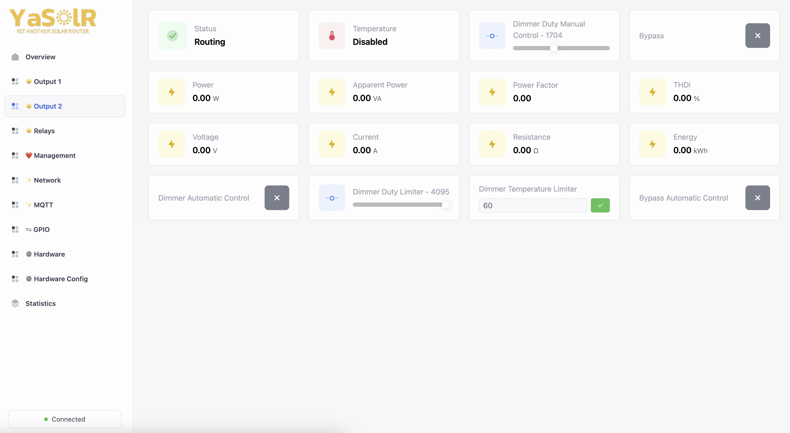](assets/img/screenshots/output2.jpeg) |

- `Status`
  - `Disabled`: Output is disabled (dimmer disabled or other reason)
  - `Idle`: Output is not routing and not in bypass mode
  - `Routing`: Routing in progress
  - `Bypass`: Bypass has been activated manually
  - `Bypass Auto`: Bypass has been activated based on automatic rules
- `Temperature`: This is the temperature reported by the sensor in water tank

**Energy:**

- `Power`: Routed power.
- `Apparent Power`: Apparent power in VA circulating on the wires.
- `Power Factor`: Power factor (if lower than 1, mainly composed of harmonic component). Ideal is close to 1.
- `THDi`: This is the estimated level of harmonics generated by this output. The lower, the better.
- `Voltage`: The dimmed RMS voltage sent to the resistive load.
- `Current`: The current in Amp sent to the resistive load.
- `Resistance`: The resistance of the load.
- `Energy`: The total accumulated energy routed by this output, stored in hardware (JSY and/or PZEM).

**Dimmer Control:**

- `Dimmer Automatic Control`: ON/OFF switch to select automatic routing mode or manual control of the dimmer.
- `Dimmer Level` / `Dimmer Level Manual Control`: Slider to control the dimmer level manually. Only available when the dimmer is not in automatic mode. Otherwise the dimmer level is displayed.
- `Grid Excess Sharing`: Only available in automatic mode. Allows to share the available grid excess between outputs so that each output are activated and will receive a certain percentage of grid excess.
  If output 1 is set to 100%, then output 2 will only be activated when output 1 is at 100%.
  If output 1 is set to 0%, then output 1 will be skipped and all the grid excess will go to output 2.
- `Dimmer Duty Limiter`: Slider to limit the level of the dimmer in order to limit the routed power.
- `Dimmer Temperature Limiter`: Temperature threshold when the dimmer will stop routing. This temperature can be different than the temperature used in auto bypass mode.

**Bypass Control:**

- `Bypass Automatic Control`: ON/OFF switch to select automatic bypass mode or manual control of the bypass.
- `Bypass` / `Bypass Manual Control`: Switch to control the bypass manually. Only available when the bypass is not in automatic mode. Otherwise the bypass state is displayed.
- `Bypass Week Days`: Days of the week when the bypass can be activated.
- `Bypass Start Time` / `Bypass Stop Time`: The time range when the auto bypass is allowed to start.
- `Bypass Start Temperature`: The temperature threshold when the auto bypass will start: the temperature of the water tank needs to be lower than this threshold.
- `Bypass Stop Temperature`: The temperature threshold when the auto bypass will stop: the temperature of the water tank needs to be higher than this threshold.

**All these settings are applied immediately and do not require a restart**

## Dashboard / Relays

[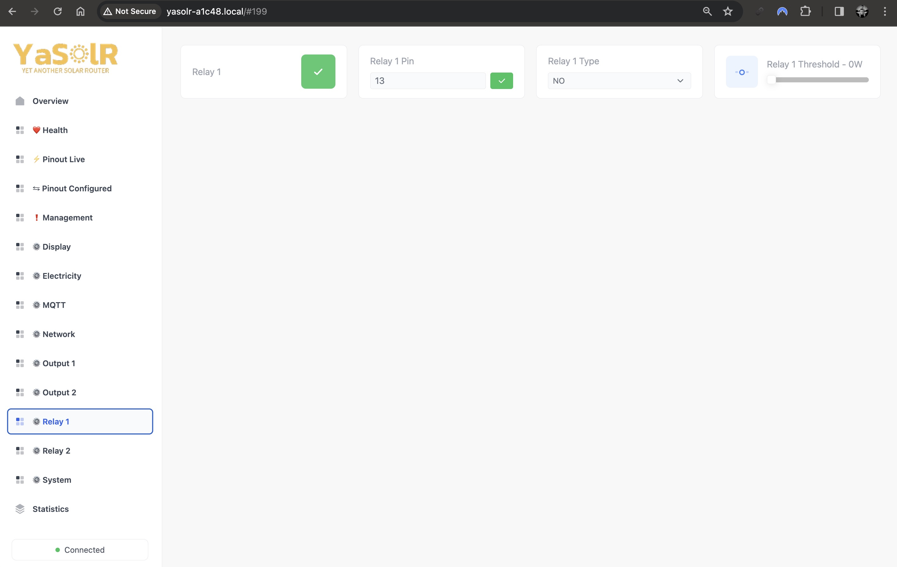](assets/img/screenshots/relays.jpeg)

- `Relay X Automatic Control: Connected Load (Watts)`: You can specify the resistive load power in watts connected to the relay.
  If you do so, the relay will be activated automatically based on the grid power.
- `Relay X Manual Control`: ON/OFF switch to control the relay manually. Only available when the relay is not in automatic mode. Otherwise the relay state is displayed.

**All these settings are applied immediately and do not require a restart**

YaS☀️lR supports 2 relays (Electromechanical or SSR, controlled with 3.3V DC) to control external loads, or to be connected to the A1 and A2 terminals of a power contactor.
Relays can also be connected to the other resistance of the water tank (tri-phase resistance) as described in the [recommendations to reduce harmonics and flickering](./overview#recommendations-to-reduce-harmonics-and-flickering), in order to improve the routing and reduce harmonics.
You must use a SSR for that, because the relay will be switched on and off frequently.

**The voltage is not dimmed**: these are 2 normal relays.

These relays can also be **controlled manually**, from MQTT, REST API, Home Assistant, Jeedom, etc.

**Pay attention that there is little to no hysteresis on the relays**.
So do not use the automatic feature to switch non-resistive loads such as pumps, electric vehicle chargers, etc.

**If you need to switch other types of load** in a more complex way with some hysteresis or other complex conditions, you can use the MQTT, REST API, Home Assistant or Jeedom to query the `Virtual Power` metric and execute an automation based on this value.
The automation can then control the router relays remotely. The relays need to be set in `Manual Control`.

Remember that **Solar Router's relays are not power contactors** and should not be used to directly control high power loads like an Electric Vehicle charge, a pump, etc.

- **For an EV charge control**: an EV charging box which can dynamically change the charging current though a PWM signal (pilot wire) is recommended. OpenEVSE can do that and take as input the `Virtual Power` metric of this router to adjust the charging current.
- **For a pump**: a contactor is recommended which can be coupled with a Shelly EM to activate / deactivate the contactor remotely, and it can be automated by Home Assistant or Jeedom based on the `Virtual Power` metric of this router, but also the hours of day, days of week, depending on the weather, and of course with some hysteresis and safety mechanisms to force the pump ON or OFF depending on some rules.

**Rules of Automatic Switching**

`Grid Virtual Power` is calculated by the router as `Grid Power - Routed Power`.
This is the power that would be sent to the grid if the router was not routing any power to the resistive loads.

`Grid Virtual Power` is negative on export and positive on import.

- The relay will automatically start when `Grid Virtual Power + Relay Load <= -3% of Relay Load`.
  In other words, the relay will automatically start when there is enough excess to absorb both the load connected to the relay plus 3% more of it.
  When the relay will start, the remaining excess not absorbed by the load will be absorbed by the dimmer.

- The relay will automatically stop when `Grid Virtual Power >= 3% of Relay Threshold`.
  In other words, the relay will automatically stop when there is no excess anymore but a grid import equal to or more than 3% of the relay threshold.
  When the relay will stop, there will be some excess again, which will be absorbed by the dimmer.

For a 3000W tri-phase resistance, 3% means 30W per relay because there is 3x 1000W resistances.
For a 2100W tri-phase resistance, 3% means 21W per relay because there is 3x 700W resistances.

## Dashboard / Management

[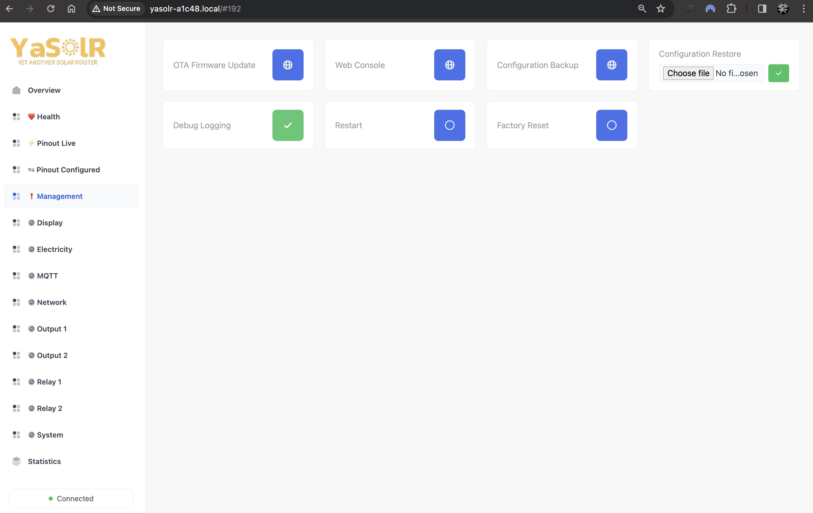](assets/img/screenshots/management.jpeg)

- `Configuration Backup`: Backup the current configuration of the router.
- `Configuration Restore`: Restore a previously saved configuration.
- `OTA Firmware Update`: Go to the firmware update page.
- `Restart`: Restart the router.
- `Debug`: Activate or deactivate debug logging.
- `Console`: Go to the Web Console page.
- `Energy Reset`: Reset the energy stored in all devices (JSY and PZEM) of the router.
- `Factory Reset`: Reset the router to factory settings and restart it.

## Dashboard / Network

[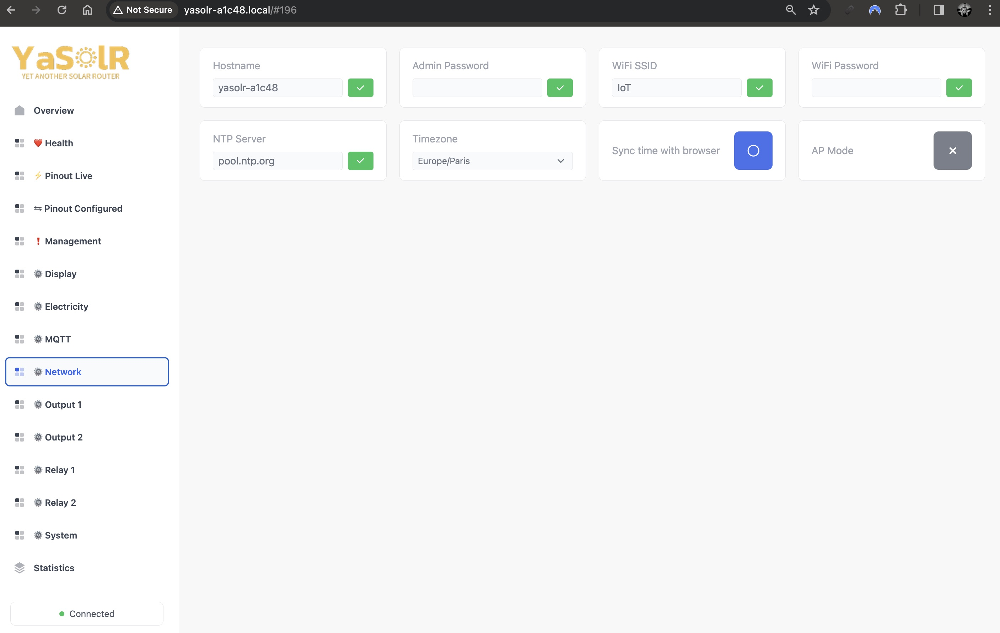](assets/img/screenshots/network.jpeg)

- `Admin Password`: the password used to access (there is no password by default):
  - Any Web page, including the [REST API](rest)
  - The Access Point when activated
  - The Captive Portal when the router restarts and no WiFi is available

**Time settings:**

- `NTP Server`: the NTP server to use to sync the time
- `Timezone`: the timezone to use for the router
- `Sync time with browser`: if the router does not have access to Internet or is not able to sync time (I.e. in AP mode), you can use this button to sync the time with your browser.

**WiFi settings:**

- `WiFi SSID`: the Home WiFi SSID to connect to
- `WiFi Password`: the Home WiFi password to connect to
- `Stay in AP Mode`: whether to activate or not the Access Point mode: switching the button will ask the router to stay in AP mode after reboot.
  You will need to connect to its WiFi to access the dashboard again.

**The ESP32 must be restarted to apply the changes.**

## Dashboard / MQTT

[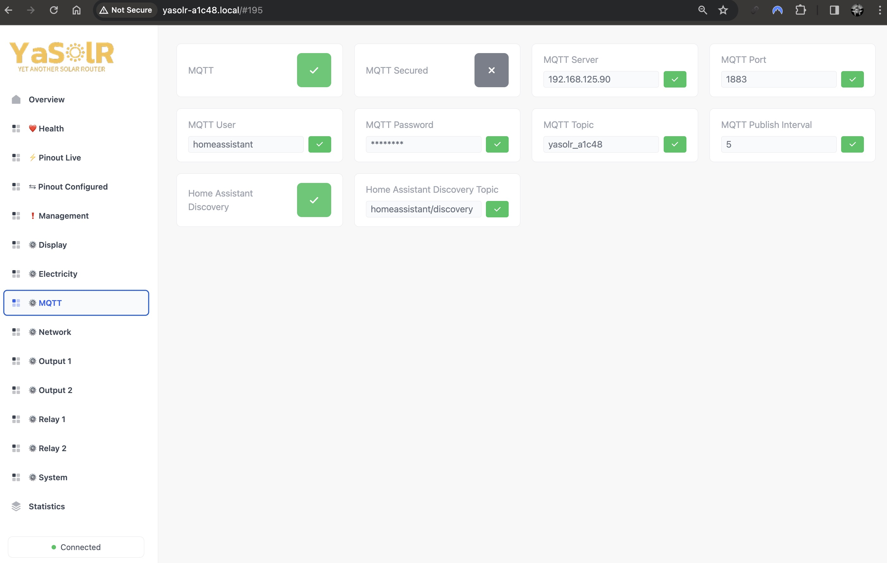](assets/img/screenshots/mqtt.jpeg)

- `Server`: the MQTT broker address
- `Port`: the MQTT broker port (usually `1883` or `8883` for TLS)
- `Username`: the MQTT username
- `Password`: the MQTT password
- `SSL / TLS`: whether to use TLS or not (false by default). If yes, you must upload the server certificate.
- `Server Certificate`: when using SSL, you need to upload the server certificate.
- `Publish Interval`: the interval in seconds between each MQTT publication of the router data.
  The default value is `5` seconds.
- `Base Topic`: the MQTT topic prefix to use for all the topics published by the router.
  It is set by default to `yasolr_<ID>`.
  I strongly recommend to keep this default value. The ID won't change except if you change the ESP board.

**MQTT must be restarted to apply the changes.**

### MQTT as a Grid Source

- `Grid Voltage from MQTT Topic`: if set to a MQTT Topic, the router will listen to it to read the Grid voltage.
  **Any measurement device (JSY or PZEM) will still have priority over MQTT**.

- `Grid Power from MQTT Topic`: if set to a MQTT Topic, the router will listen to it to read the Grid power.
  **It takes precedence over any other source, even a JSY connected to the ESP32**.
  The reason is that it is impossible to know if the second channel of the JSY is really installed and used to monitor the grid power or not.

**The ESP32 must be restarted to apply the changes.**

MQTT topics are less accurate because depend on the refresh rate of this topic, and an expiration delay of a few seconds is set in order to stop any routing if no update is received in time.

### Home Assistant Discovery

YaS☀️lR supports Home Assistant Discovery: if configured, it will **automatically create a device** for the Solar Router in Home Assistant under the MQTT integration.

| [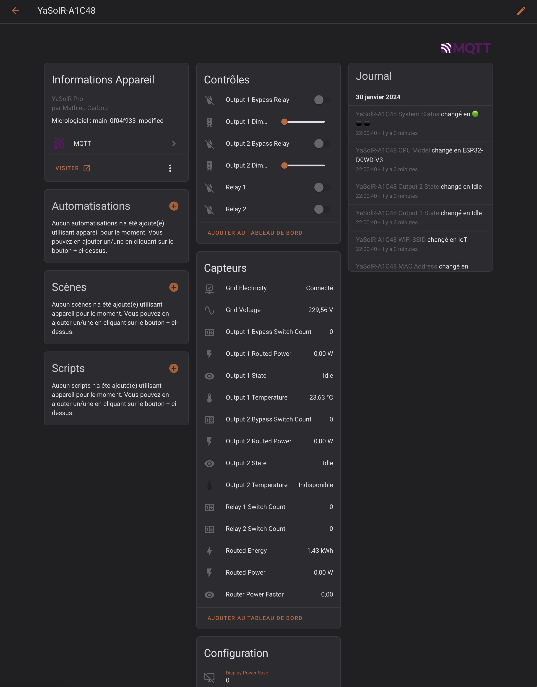](assets/img/screenshots/ha_disco_1.jpeg) | [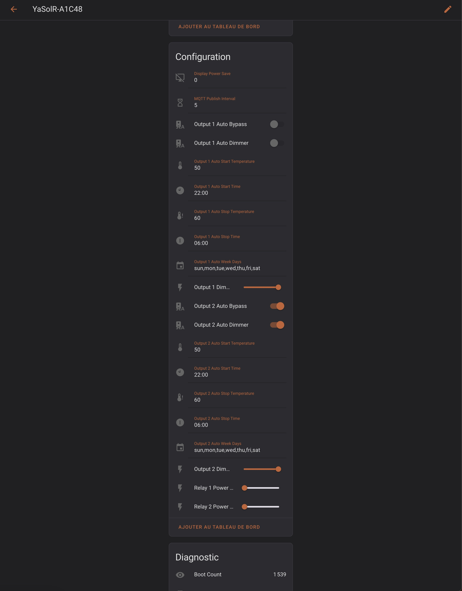](assets/img/screenshots/ha_disco_2.jpeg) |

- `Home Assistant Integration`: whether to activate or not MQTT Discovery
- `Home Assistant Discovery Topic`: the MQTT topic prefix to use for all the topics published by the router for Home Assistant Discovery.
  It is set by default to `homeassistant/discovery`.
  I strongly recommend to keep this default value and configure Home Assistant to use this topic prefix for Discovery in order to separate state topics from discovery topics.

**MQTT must be restarted to apply the changes.**

The complete reference of the published data in MQTT is available [here](mqtt).
The published data can be explored with [MQTT Explorer](https://mqtt-explorer.com/).

[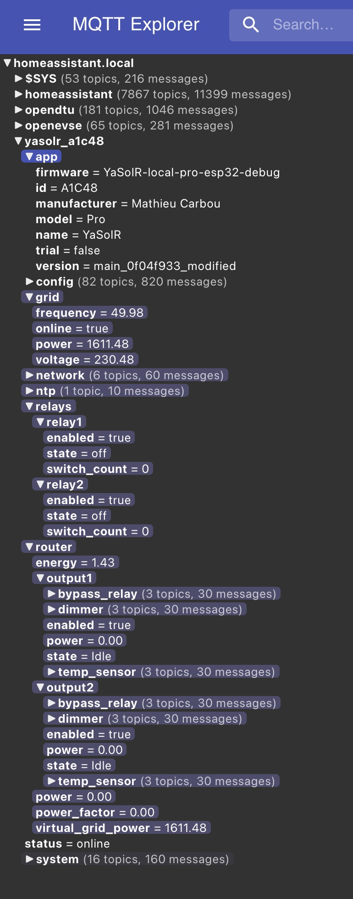{: height="800" }](assets/img/screenshots/mqtt_explorer.jpeg)

**Activating MQTT Discovery in Home Assistant**

You can read more about Home Assistant Discovery and how to configure it [here](https://www.home-assistant.io/docs/mqtt/discovery/).

Here is a configuration example for Home Assistant to move the published state topics under the `homeassistant/states`:

```yaml
# https://www.home-assistant.io/integrations/mqtt_statestream
mqtt_statestream:
  base_topic: homeassistant/states
  publish_attributes: true
  publish_timestamps: true
  exclude:
    domains:
      - persistent_notification
      - automation
      - calendar
      - device_tracker
      - event
      - geo_location
      - media_player
      - script
      - update
```

To configure the discovery topic, you need to go to [http://homeassistant.local:8123/config/integrations/integration/mqtt](http://homeassistant.local:8123/config/integrations/integration/mqtt), then click on `configure`, then `reconfigure` then `next`, then you can enter the discovery prefix `homeassistant/discovery`.

Once done on Home Assistant side and YaS☀️lR side, you should see the Solar Router device appear in Home Assistant in the list of MQTT devices.

## Dashboard / GPIO

[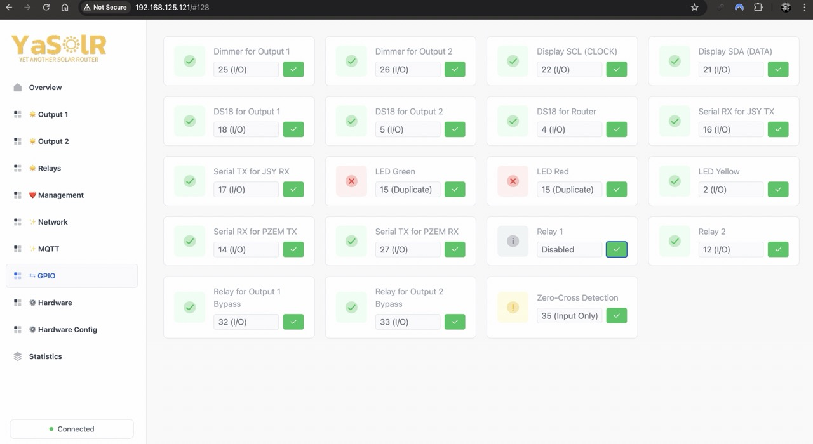](assets/img/screenshots/gpio.jpeg)

This section allows to configure the pinout for the connected hardware and get some validation feedback.

- Set the value to **-1** to disable the pin.
- Set the input to **blank** and save to reset the pin to its default value.

If you see a warning with `(Input Only)`, it means that this configured pin can only be used to read
data. It perfectly OK for a ZCD, but you cannot use a pin that can only be read for a relay, DS18 sensor, etc.

**If you change one of these settings, please stop and restart the corresponding Hardware.**

## Dashboard / Hardware

[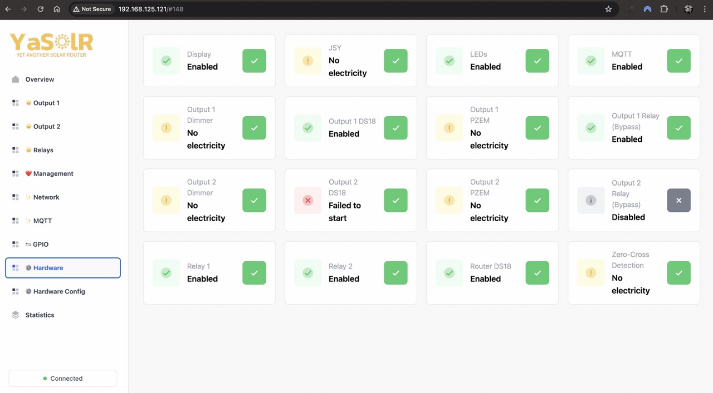](assets/img/screenshots/hardware.jpeg)

This section allows to enable / disable some features of the router, and get some feedback in case some activated features cannot be activated.

All these components are activated **live without the need to restart the router**.

## Dashboard / Hardware Config

[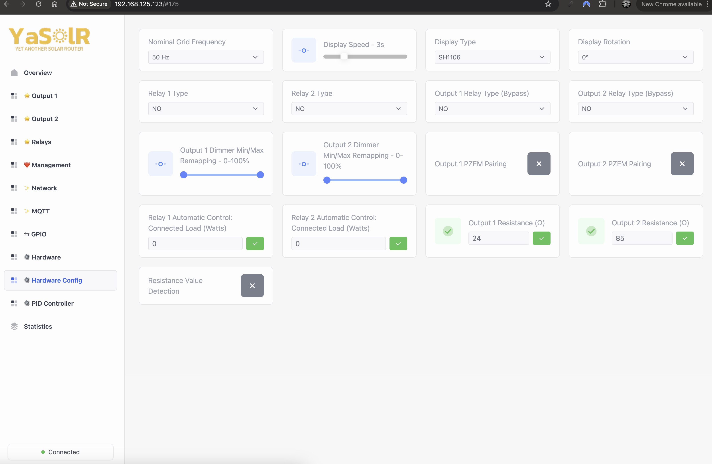](assets/img/screenshots/hardware_config.jpeg)

- `Nominal Grid Frequency`: the nominal grid frequency.
- `Display Type`: the type of display used.
- `Display Speed`: the speed at which the display will refresh to the next page.
- `Display Rotation`: the rotation of the display.
- `Output 1 PZEM Pairing`: starts the pairing procedure for Output 1 PZEM-004T v3 at address 0x01.
- `Output 2 PZEM Pairing`: starts the pairing procedure for Output 2 PZEM-004T v3 at address 0x02.
- `Output 1 Bypass Relay Type`: the type of relay for Output 1 Bypass: Normally Open or Normally Closed.
- `Output 2 Bypass Relay Type`: the type of relay for Output 2 Bypass: Normally Open or Normally Closed.
- `Relay 1 Type`: the type of relay for Relay 1: Normally Open or Normally Closed.
- `Relay 2 Type`: the type of relay for Relay 2: Normally Open or Normally Closed.

**If you change one of these settings, please stop and restart the corresponding Hardware.**

### Resistance Calibration

The router **needs to know the resistance value of the load**. There several ways to set it.

1. **Measure yourself:** You can manually enter the resistance values in the `Hardware Config` page.
   If you chose to do so, be careful to put a value that you have correctly measured!
   An approximation will cause the router to not properly work because it won't be able to adjust the exact amount of power to send.

- `Output 1 Resistance`: the resistance value in Ohm of the load connected to Output 1
- `Output 2 Resistance`: the resistance value in Ohm of the load connected to Output 2

2. **PZEM-004T v3:** If you have wired a PZEM-004T v3 connected to each output, it will measure the resistance value when routing.
   In this case, **you do not have to enter any value**, leave the fields to 0.
   The PZEM will measure the resistance value while routing.

3. **JSY-MK-194T:** If you have a JSY-MK-194T, you can manually activate the dimmer one by one to 100% and wait about 5 seconds for the values to stabilize.
   The router will then display the resistance value in the `Overview` page, thanks to the JSY.
   You just have to report it in the `Hardware Config` page.

## Dashboard / Statistics

[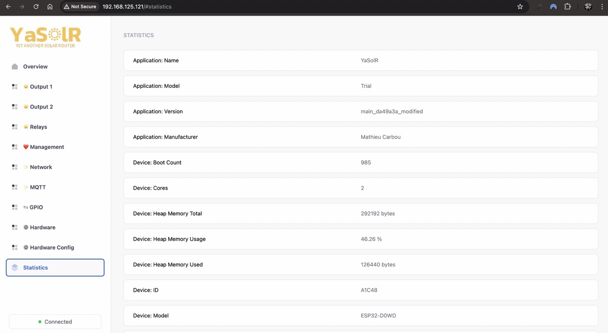](assets/img/screenshots/statistics.jpeg)

This page shows a lot of statistics and information on the router.

## Important Hardware Information

### Bypass Relay

Installing a relay for bypass is optional: if installed, the relay will be used to power the heater, and the dimmer will be set to 0.

If not installed, when activating bypass mode, the dimmer will be used and set to 100%.
The advantage is a simple setup, the drawbacks are:

- the dimmer will heat up.
- the power output of he dimmer counts as routed power so the routed power and energy will contain the bypass power also.

### Display

Supported displays are any I2C OLED Display of type `SSD1307`, `SH1106`, `SH1107`.

`SH1106` is recommended and has been extensively tested.

The display will look like a carousel with a maximum of 5 pages:

- Global information
- Network information
- Router information with relays
- Output 1 information
- Output 2 information

[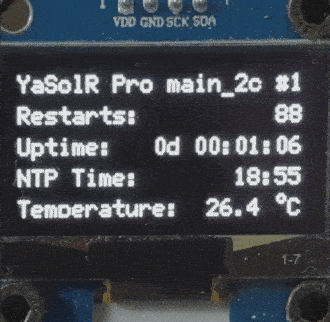](assets/img/screenshots/display.gif)

### JSY-MK-194T

The JSY is used to measure:

1. the grid power and voltage
2. the total routed power of the outputs combined (optional)

The JSY can be replaced by MQTT, reading the power and voltage from MQTT topics.
See [MQTT as a Grid Source](#mqtt-as-a-grid-source).

#### Remote JSY

JSY can also be replaced with a remote JSY without any impact on routing speed.
You can install a JSY with an ESP32 on the electric panel and it will send its JSY data to the router remotely through an optimized communication protocol (UDP) several times per second.

You can look in the [JSY project](https://oss.carbou.me/MycilaJSY/) to find more information about how to setup remote JSY and the supported protocols.
The `Sender` program is available at:

[https://github.com/mathieucarbou/MycilaJSY/tree/main/examples/RemoteUDP](https://github.com/mathieucarbou/MycilaJSY/tree/main/examples/RemoteUDP)

This is a standalone application that looks looks like this and will show all your JSY data, help you manage it, and also send the data through UDP.


When using a remote JSY with the router, the following rules apply:

- The voltage will always be read if possible from a connected JSY or PZEM, then from a remote JSY, then from MQTT.
- The grid power will always be read first from MQTT, then from a remote JSY, then from a connected JSY.

**Speed**

The JSY Remote through UDP is nearly as fast as having the JSY wired to the ESP.
All changes to the JSY are immediately sent through UDP to the listener at a rate of about **20 messages per second.**
This is the rate at which the JSY usually updates its data.

### LEDs

The LEDs are used to notify the user of some events like reset, restarts, router ready, routing, etc.

| **LIGHTS** | **SOUNDS**       | **STATES**                      |
| :--------: | ---------------- | ------------------------------- |
| `🟢 🟡 🔴` | `BEEP BEEP`      | `STARTED` + `POWER` + `OFFLINE` |
| `🟢 🟡 ⚫` |                  | `STARTED` + `POWER`             |
| `🟢 ⚫ 🔴` | `BEEP BEEP`      | `STARTED` + `OFFLINE`           |
| `🟢 ⚫ ⚫` | `BEEP`           | `STARTED`                       |
| `⚫ 🟡 🔴` | `BEEP BEEP BEEP` | `RESET`                         |
| `⚫ 🟡 ⚫` |                  |                                 |
| `⚫ ⚫ 🔴` | `BEEP BEEP`      | `RESTART`                       |
| `⚫ ⚫ ⚫` |                  | `OFF`                           |

- `STARTED`: application started and WiFi or AP mode connected
- `OFFLINE`: application disconnected from WiFi or disconnected from grid electricity
- `POWER`: power allowed to be sent (either through relays or dimmer)
- `RESTART`: application is restarting following a manual restart
- `RESET`: application is restarting following a manual reset
- `OFF`: application not working (power off)

### PZEM-004T V3

Each output supports the addition of a PZEM-004T v3 sensor to monitor the power sent to the resistive load specifically for this output.
This also unlocks some additional features such as **independent outputs** and the ability to balance the excess power between outputs.

Thanks to the PZEM per output, it is also possible to get some more precise information like the dimmed RMS voltage, resistance value, etc.

#### Pairing procedure

The PZEM-004T v3 devices has a special installation mode: you can install 2 PZEM-004T v3 devices on the same Serial TX/RX.
To communicate with the right one, each output will use a different slave address.
The initial setup requires to pair each PZEM-004T v3 with the corresponding output.

1. Connect the 2 PZEM-004T v3 devices to the grid (L/N) and install the clamp around the wire at the exit of the dimmer of first output
2. Only connect the terminal wire (+5V, GND, RX, TX) of the first PZEM-004T v3 to pair to Output 1
3. Boot the ESP32 wit the router firmware
4. Press the `PZEM Pairing` button in the `Output 1` menu
5. Verify that the pairing is successful
6. Disconnect the PZEM-004T v3 from the ESP32
7. Connect the second PZEM (which has its clamp at the exit of the dimmer of the second output) to the ESP32
8. Press the `PZEM Pairing` button in the `Output 2` menu this time
9. Verify that the pairing is successful
10. Now connect the 2 PZEM-004T v3 devices to the ESP32

You can verify that the pairing is successful by trying to activate the dimmer in the overview page, and see if you get the output power.

Check also the logs in the Web Console at `http://yasolr-vwxyz.local/console` while doing the pairing procedure.

This complex pairing procedure is not specific to this router project but is common to any PZEM-004T device when using several PZEM-004T v3 devices on the same Serial TX/RX.
You can read more at:

- [mathieucarbou/MycilaPZEM004Tv3](https://github.com/mathieucarbou/MycilaPZEM004Tv3)
- [mandulaj/PZEM-004T-v30](https://github.com/mandulaj/PZEM-004T-v30)

### Temperature Sensor

The temperature sensors are used to monitor the water tank but also to trigger an automatic heating based on temperature levels (called **auto bypass**).

Supported temperature sensor: `DS18B20`

A temperature sensor can also be used to monitor the router itself.

### Zero-Cross Detection

The Zero-Cross Detection (ZCD) module is used to detect the zero-crossing of the grid voltage.
It is required, whether you use a Robodyn or SSR or any routing algorithm (phase control or burst mode).
The Robodyn includes a ZCD (its ZC pin).

### Compatibility with EV box like OpenEVSE

The router exposes through API and MQTT the **Virtual Grid Power**, which is the value of Grid Power you would have if the router was not routing.

You can use this value to inject in the EV box in order to prioritize EV charging over routing to the water tank.

This is usually acceptable to give the EV box a priority over the water tank, because the water tank only need a small amount of routed energy to start heating, while the EV usually requires a threshold to start charging.
So the router will take whatever is not used by the EV box.

## Help and support

- **Facebook Group**: [https://www.facebook.com/groups/yasolr](https://www.facebook.com/groups/yasolr)

- **GitHub Discussions**: [https://github.com/mathieucarbou/YaSolR-OSS/discussions](https://github.com/mathieucarbou/YaSolR-OSS/discussions)

- **GitHub Issues**: [https://github.com/mathieucarbou/YaSolR-OSS/issues](https://github.com/mathieucarbou/YaSolR-OSS/issues)
