# YaS☀️lR Manual

- [Quick Start](#quick-start)
- [Initial Setup and Factory Reset](#initial-setup-and-factory-reset)
  - [Captive Portal (Access Point) and WiFi](#captive-portal-access-point-and-wifi)
  - [Access Point Mode](#access-point-mode)
- [Detailed Manual](#detailed-manual)
  - [Overview menu](#overview-menu)
  - [Health menu](#health-menu)
  - [Pinout Live menu](#pinout-live-menu)
  - [Pinout Configured menu](#pinout-configured-menu)
  - [Management menu](#management-menu)
  - [Display configuration menu](#display-configuration-menu)
  - [Electricity configuration menu](#electricity-configuration-menu)
    - [JSY-MK-194T](#jsy-mk-194t)
    - [Zero-Cross Detection](#zero-cross-detection)
    - [MQTT Sources](#mqtt-sources)
    - [Grid Power and Voltage](#grid-power-and-voltage)
  - [MQTT configuration menu](#mqtt-configuration-menu)
    - [Home Assistant Discovery](#home-assistant-discovery)
  - [Network configuration menu](#network-configuration-menu)
    - [WiFi and access](#wifi-and-access)
    - [Time settings](#time-settings)
  - [Output configuration menu](#output-configuration-menu)
    - [Dimmer](#dimmer)
    - [Temperature Sensor](#temperature-sensor)
    - [ByPass Relay](#bypass-relay)
    - [Auto Bypass](#auto-bypass)
    - [Output Power Monitoring with PZEM-004T V3](#output-power-monitoring-with-pzem-004t-v3)
  - [Relay configuration menu](#relay-configuration-menu)
  - [System configuration menu](#system-configuration-menu)
    - [System temperature](#system-temperature)
    - [Buzzer](#buzzer)
    - [LEDs](#leds)
    - [Push Button](#push-button)
  - [Statistics page](#statistics-page)
  - [Configuration Debug page](#configuration-debug-page)
  - [Web Console page](#web-console-page)
  - [Web OTA page](#web-ota-page)
- [Help and support](#help-and-support)

## Quick Start

When everything is wired and installed properly, you can:

1. Flash the downloaded firmware (see [Initial Setup and Factory Reset](#initial-setup-and-factory-reset))
2. Power on the system to start the application
3. Connect to the WiFI: `YaSolR-xxxxxx`
4. When you hear the 2 beeps and/or see the yellow light, the Captive Portal has been started and is waiting for you to connect to its WiFi to select the WiFI network to join (or work in AP mode)

   

5. After selecting your network and entering your WiFi credentials, the application will join your WiFi and you will be able to connect to it **by using the IP address assigned by your router** (check your router to find it).

## Initial Setup and Factory Reset

Firmware can be downloaded here : [](https://yasolr.carbou.me/download)

Flash with `esptool.py` (Linux / MacOS):

```bash
# Erase the memory (including the user data)
esptool.py \
  --port /dev/ttyUSB0 \
  erase_flash
```

```bash
# Flash initial firmware and partitions
esptool.py \
  --port /dev/ttyUSB0 \
  --chip esp32 \
  --before default_reset \
  --after hard_reset \
  write_flash \
  --flash_mode dout \
  --flash_freq 40m \
  --flash_size detect \
  0x0 YaSolR-VERSION-MODEL-CHIP.factory.bin
```

Do not forget to change the port `/dev/ttyUSB0` to the one matching your system.
For example on Mac, it is often `/dev/cu.usbserial-0001` instead of `/dev/ttyUSB0`.

With [Espressif Flash Tool](https://www.espressif.com/en/support/download/other-tools) (Windows):

**Be careful to not forget the `0`.**


### Captive Portal (Access Point) and WiFi

> Captive Portal and Access Point address: [http://192.168.4.1/](http://192.168.4.1/)

A captive portal (Access Point) is started for the first time to configure the WiFi network, or when the application starts and cannot join an already configured WiFi network fro 15 seconds.


The captive portal is only started for 3 minutes, to allow configuring a (new) WiFi network.
After this delay, the portal will close, and the application will try to connect again to the WiFi.
And again, if the WiFi cannot be reached, connected to, or is not configured, the portal will be started again.

This behavior allows to still have access to the application in case of a WiFi network change, or after a power failure, when the application restarts.
If the application restarts before the WiFi is available, it will launch the portal for 3 minutes, then restart and try to join the network again.

In case of WiFi disruption (WiFi temporary down), the application will keep trying to reconnect.
If it is restarted and the WiFi is still not available, the Captive Portal will be launched.

### Access Point Mode

You can also chose to not connect to your Home WiFi and keep the AP mode active.
In this case, you will need to connect to the router WiFi each time you want to access it.

In AP mode, all the features depending on Internet access and time are not available (MQTT, NTP).
You will have to manually sync the time from your browser to activate the auto bypass feature.

## Detailed Manual

Here are the main links to know about in the application:

- `http://yasolr.local/`: Home Page
- `http://yasolr.local/console`: Web Console
- `http://yasolr.local/update`: Web OTA
- `http://yasolr.local/config`: Configuration Debug Page
- `http://yasolr.local/api/*`: [REST API](web)

_(replace `yasolr.local` with the IP address of the router)_

And here is the main menu of the application:

[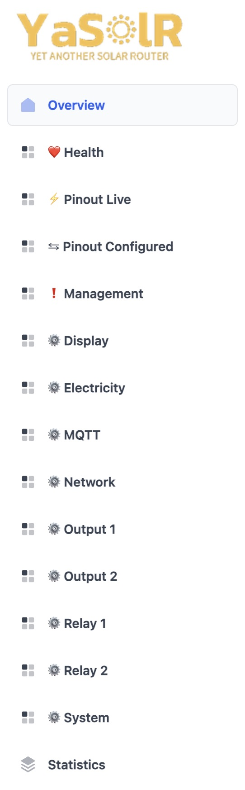{: height="500" }](./assets/img/screenshots/menu.jpeg)

### Overview menu

The Overview section shows the main information about the router and provides access to some basic actions.
This is also the main page.

[](assets/img/screenshots/overview.jpeg)

**General information:**

- `Grid Power`: This is the measured grid import or export.
- `System temperature`: the temperature inside the router box

**Relays:**

- `Relay x`: Allows to control the state of the relay x. It is only available when the relay is not working in automatic mode wit ha threshold set.

**Router outputs:**

- `Output x Bypass`: This allows to control the state pf the bypass relay of output x. It is only available when the bypass mode is not automatically handled.
- `Output x Dimmer`: This slider allows to manually control the dimmer of output x. It is only available when the dimmer is not in automatic mode.
- `Output x Status`
  - `Disabled`: Output is disabled (dimmer disabled or other reason - see Health menu)
  - `Idle`: No electricity output
  - `Routing`: Routing in progress
  - `Manual Bypass`: Bypass has been activated manually
  - `Auto Bypass`: Bypass has been activated based on automatic rules
- `Output x Temperature`: This is the temperature reported by the sensor in water tank of output x

Also, if the PZEM-004T v3 measurement devices are installed on each output, the following information will be available per output:

- `Output x Power`: The **measured** routed power by this output
- `Output x Voltage`: The dimmed RMS voltage sent to the resistive load. This is the voltage that the dimmer is sending to the resistive load according to its phase angle and triggering delay.
  This is a theoretical value that in reality might be a little different than whats can be observed with a multimeter because the real value depends on several factors like system speed, hardware, ZCD quality, etc.
- `Output x Current`: The **measured** current in Amp going through this output
- `Output x Resistance`: The **estimated** value of the resistance of the load. The value is computed live based on the dimmed power. It is less accurate when dimming at low level and highly accurate when the dimmer is at 100% (full power).
- `Output x Apparent Power`: The **measured** apparent power in VA of this output, which is the grid voltage multiplied by the current
- `Output x Power Factor`: The **measured** power factor of this output
- `Output x THDi`: This is the estimated level of harmonics generated by this output. The lower, the better.
- `Output x Energy`: The **measured** total accumulated energy routed by this output

**Total power measurements:**

- `Total Routed Power`: This is **measured** the total power routed by the router through the dimmers.
- `Total Routed Energy`: This is the **measured** total accumulated energy routed by the router through the dimmers.
- `Router Power Factor`: This is the **measured** measured power factor of the router.
- `Router THDi`: This is the estimated level of harmonics generated by the router. The lower, the better

**Temperatures:**

This is the temperature of the sensor installed in the water tank.

It can help automate some router features based on the water temperature, such as [Auto Bypass](#auto-bypass).

I strongly suggest to pick a `DS18B20` for this sensor because they come with a very long cable.

### Health menu

[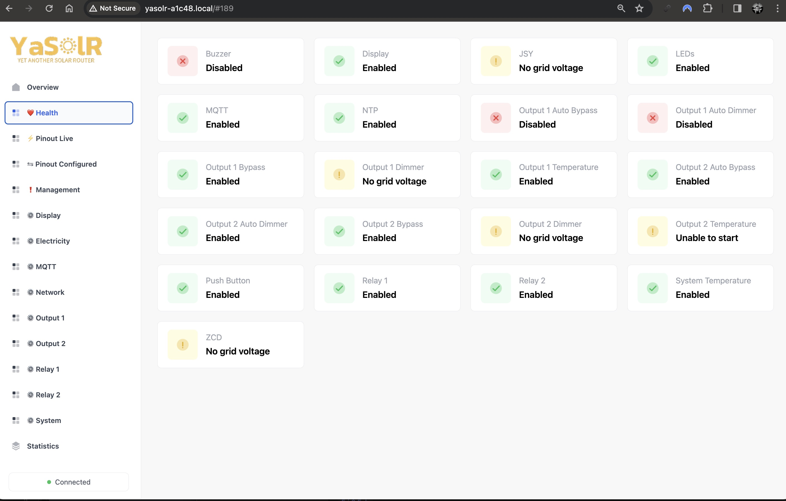](assets/img/screenshots/health.jpeg)

The health section shows the state of the router features and a small error description if something is wrong, like no grid voltage detected, unable to start a component, time synchronization issue, etc.

### Pinout Live menu

[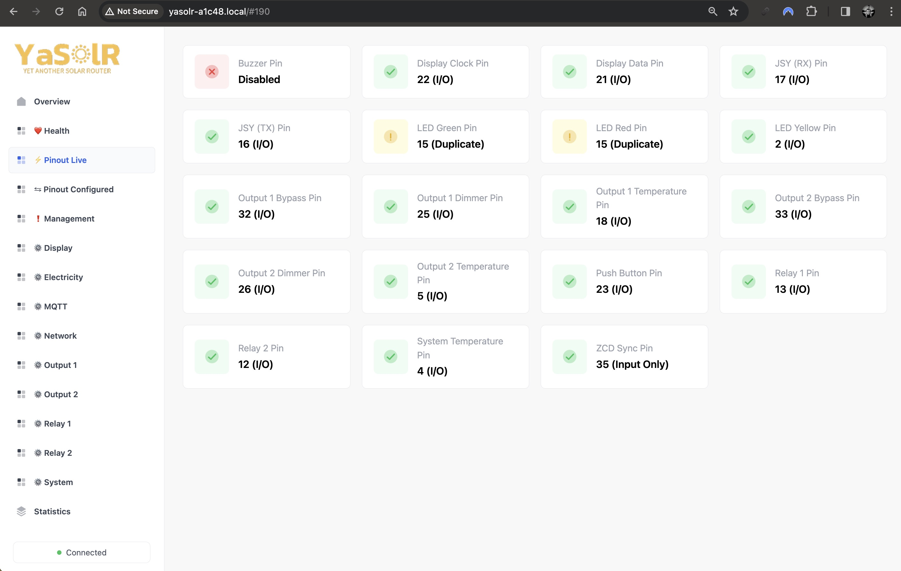](assets/img/screenshots/pinout_live.jpeg)

This section shows the live state of the router inputs and outputs for the activated features.
For example, we can see here that the LED pins have been duplicated by mistake.
This error is currently active in the system.
If a feature is not activated, the pin will be shown as `Disabled`.

### Pinout Configured menu

[](assets/img/screenshots/pinout_configured.jpeg)

This section shows the pinout configuration of the router as saved.
**This is not the live state, but what is saved in configuration.**
For example, if you change the pinout of a component, like LEDs, you need to restart if to activate the new pins.
So this view shows the current configuration, and eventually its issues, but not the live state.

Here in example we see that the live pinout for LEDs has an issue, which has been fixed since the configured pinout is now OK, so we need to restart the LED component with the new configuration in order to fix the issue.

### Management menu

[](assets/img/screenshots/management.jpeg)

The management page allows you:

- To go to the firmware update page (`/update`)
- To go to the Web console page (`/console`)
- To backup the configuration
- To restore the configuration (the router reboots only if it has detected a change in the configuration)
- To activate debug logging
- To restart the router
- To reset the router to factory settings and restart

The configuration of the router can also be modified through [MQTT](mqtt) and the [REST API](web), or through the [Configuration Debug](#configuration-debug-page) page.

### Display configuration menu

[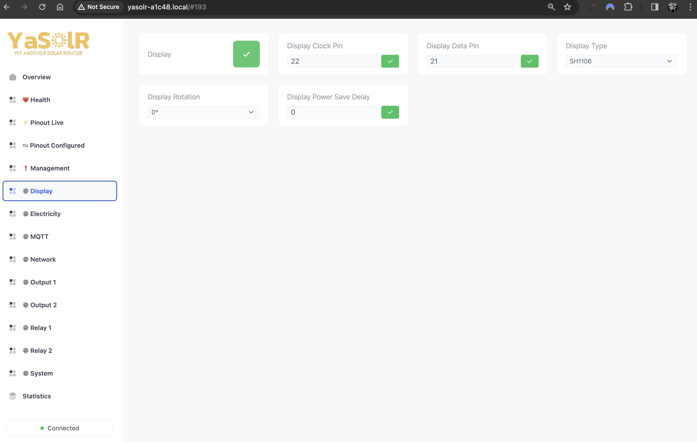](assets/img/screenshots/display.jpeg)

The display configuration page allows you to enabled or disable the display, and to configure its settings such as:

- the pins (clock, data)
- the type of I2C display: SH1106, SH1107 SSD1306
- the display rotation
- the display power save delay in seconds, `0` for no power save.
  The power save mode will turn the display off after the configured delay **if there is no display change anymore**.
  The display will be turned on again as soon as the content change.
  So if you really need to put the display to sleep when the grid power does not change a lot, you can set a short value like 1 or 2 seconds.

When a setting is changed, you need to deactivate and reactivate to apply the changes.
But you don't need to restart the router.

[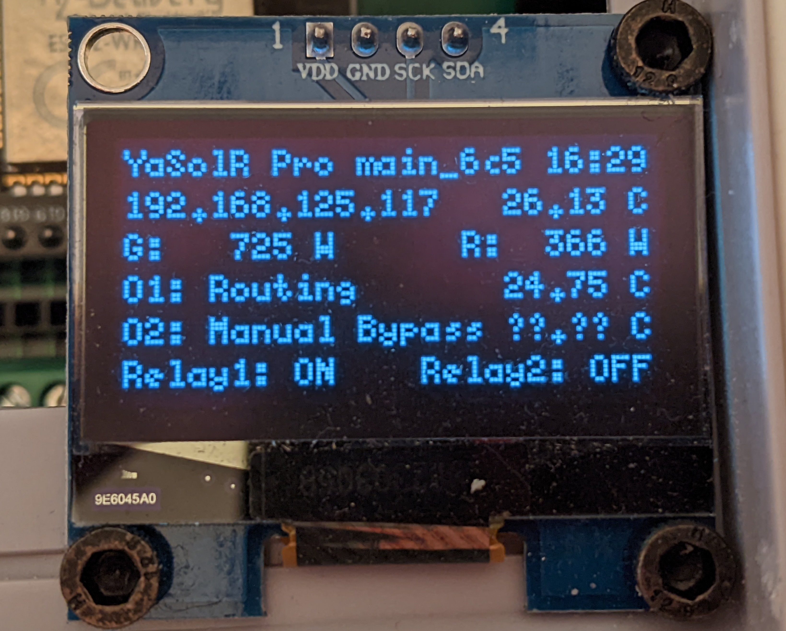](assets/img/screenshots/display_example.jpeg)

The display will show:

- **Line 1**: The application name, model, version and the current time
- **Line 2**: The IP address and the system temperature.
  Note that in AP mode or when Captive Portal is activated, the SSID is shown and when the router is not connected to the WiFi, the network status is shown.
- **Line 3**: The grid power (import or export) and the total routing power
- **Line 4**: The status of output 1 and the temperature of its water tank
- **Line 5**: The status of output 2 and the temperature of its water tank
- **Line 6**: The status of the relays

### Electricity configuration menu

[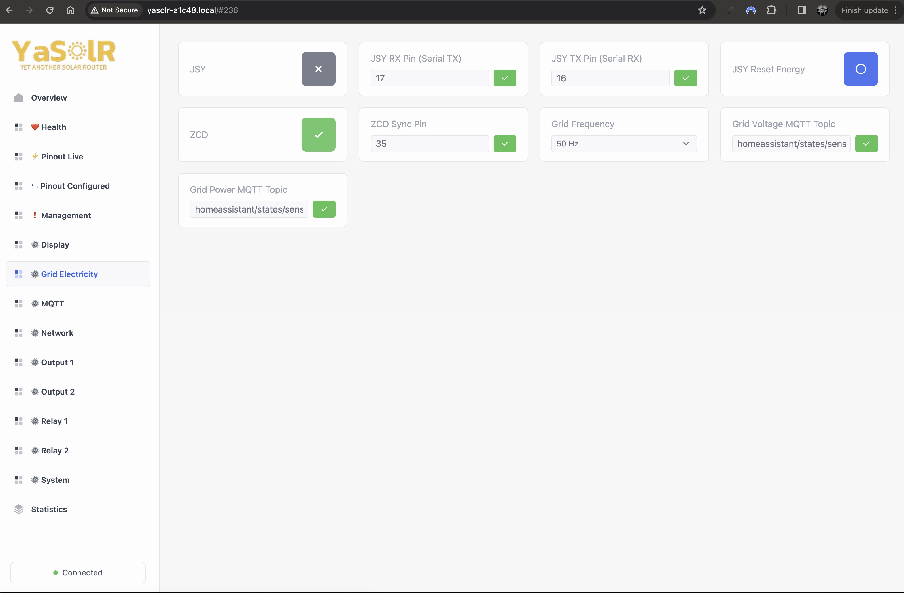](assets/img/screenshots/electricity.jpeg)

This menu allows to configure the electricity parameters of the router.

#### JSY-MK-194T

The JSY is used to measure the grid power and voltage and total router output power and stores energy data.
This is a key component of the router, but still, a router can work without it in a limited way.

- The `Reset Energy` button will reset the cumulated energy stores in the JSY.
- You can activated or deactivate the JSY
- Set the RX / TX pins

When a setting is changed, you need to deactivate and reactivate to apply the changes.
But you don't need to restart the router. If the JSY is not activated, some features won't be available like:

- Accurate routing
- Grid power will have to be taken from another source
- Power factor, THDi, Grid frequency and voltage won't be available

This is important to remember that the JSY is used to measure the total routed power: all the dimmer outputs pass through the JSY measurement clamp

#### Zero-Cross Detection

The Zero-Cross Detection (ZCD) module is used to detect the zero-crossing of the grid voltage.
It is required, whether you use a Robodyn or SSR or any routing algorithm (phase control or burst mode).
The Robodyn includes a ZCD (its ZC pin).
The SSR does not include a ZCD, so you need to add one.

- You can activate or deactivate the ZCD
- Set the ZC / Sync pin
- Set the Grid Frequency according to your location (default is 50Hz)

When a setting is changed, you need to deactivate and reactivate to apply the changes.
But you don't need to restart the router.

#### MQTT Sources

- `Grid Power MQTT Topic`: if set to a MQTT Topic, the router will listen to it to read the **Grid Power** instead of the JSY.
  This method is less accurate because it depends on the refresh rate of this topic and is linked to a 60 seconds expiration: if no data is received for 60 seconds, the Grid Power is considered to be 0 in order to stop any routing.
  This setting can be changed at runtime without restarting the router.

- `Grid Voltage MQTT Topic`: if set to a MQTT Topic, the router will listen to it to read the **Grid Voltage** instead of the JSY.
  This method is less accurate because it depends on the refresh rate of this topic and is linked to a 60 seconds expiration: if no data is received for 60 seconds, the Grid Voltage is considered to be 0 in order to stop any routing.
  This setting can be changed at runtime without restarting the router.

Here is an example of a Home Assistant configuration to publish the sensors to MQTT:

```yaml
# https://www.home-assistant.io/integrations/mqtt_statestream
mqtt_statestream:
  base_topic: homeassistant/states
  publish_attributes: true
  publish_timestamps: true
  exclude:
    domains:
      - persistent_notification
      - automation
      - calendar
      - device_tracker
      - event
      - geo_location
      - media_player
      - script
      - update
```

This is possible to even further filter and customize the published data and what is published.
Thanks to that, the router can have access and listen to any topic where data is published, including the Grid Power from a Shelly EM for example.

#### Grid Power and Voltage

Here are the sources used by the router to read the Grid Power and Voltage:

**Grid Power:**

1. Reads from MQTT if configured
2. Reads from JSY if installed

**Grid Voltage:**

1. Reads from MQTT if configured
2. Reads from JSY if installed
3. Uses a default value (230V).
   This is an acceptable fallback but can lead to wrong statistics if the voltage of the grid differs a lot from this value.

### MQTT configuration menu

[](assets/img/screenshots/mqtt.jpeg)

This section allows to configure the MQTT connection of the router:

- `MQTT`: whether to activate or not MQTT
- `MQTT Secured`: whether to use TLS or not (false by default). If yes, you must upload the server certificate.
- `MQTT Server Certificate`: when using SSL, you need to upload the server certificate.
- `MQTT Server`: the MQTT broker address
- `MQTT Port`: the MQTT broker port (usually `1883` or `8883` for TLS)
- `MQTT User`: the MQTT username
- `MQTT Password`: the MQTT password
- `MQTT Topic`: the MQTT topic prefix to use for all the topics published by the router.
  It is set by default to `yasolr_<ID>`.
  I strongly recommend to keep this default value. The ID won't change except if you change the ESP board.
- `MQTT Publish Interval`: the interval in seconds between each MQTT publication of the router data.
  The default value is `5` seconds.

When a setting is changed, you need to deactivate and reactivate to apply the changes.
But you don't need to restart the router.

The complete reference of the published data in MQTT is available [here](mqtt.md).
The published data can be explored with [MQTT Explorer](https://mqtt-explorer.com/).

[{: height="800" }](assets/img/screenshots/mqtt_explorer.jpeg)

#### Home Assistant Discovery

YaS☀️lR supports Home Assistant Discovery: if configured, it will **automatically create a device** for the Solar Router in Home Assistant under the MQTT integration.
For that, you need to configure:

- `Home Assistant Discovery`: whether to activate or not MQTT Discovery
- `Home Assistant Discovery Topic`: the MQTT topic prefix to use for all the topics published by the router for Home Assistant Discovery.
  It is set by default to `homeassistant/discovery`.
  I strongly recommend to keep this default value and configure Home Assistant to use this topic prefix for Discovery in order to separate state topics from discovery topics.

You can read more about Home Assistant Discovery and how to configure it [here](https://www.home-assistant.io/docs/mqtt/discovery/).

Here is a configuration example for Home Assistant to move the published state topics under the `homeassistant/states`:

```yaml
# https://www.home-assistant.io/integrations/mqtt_statestream
mqtt_statestream:
  base_topic: homeassistant/states
  publish_attributes: true
  publish_timestamps: true
  exclude:
    domains:
      - persistent_notification
      - automation
      - calendar
      - device_tracker
      - event
      - geo_location
      - media_player
      - script
      - update
```

To configure the discovery topic, you need to go [http://homeassistant.local:8123/config/integrations/integration/mqtt](http://homeassistant.local:8123/config/integrations/integration/mqtt), then click on `configure`, then `reconfigure` then `next`, then you can enter the discovery prefix `homeassistant/discovery`.

Once done on Home Assistant side and YaS☀️lR side, you should see the Solar Router device appear in Home Assistant in the list of MQTT devices.
Here is an example of the Solar Router device in Home Assistant:

| [](assets/img/screenshots/ha_disco_1.jpeg) | [](assets/img/screenshots/ha_disco_2.jpeg) | [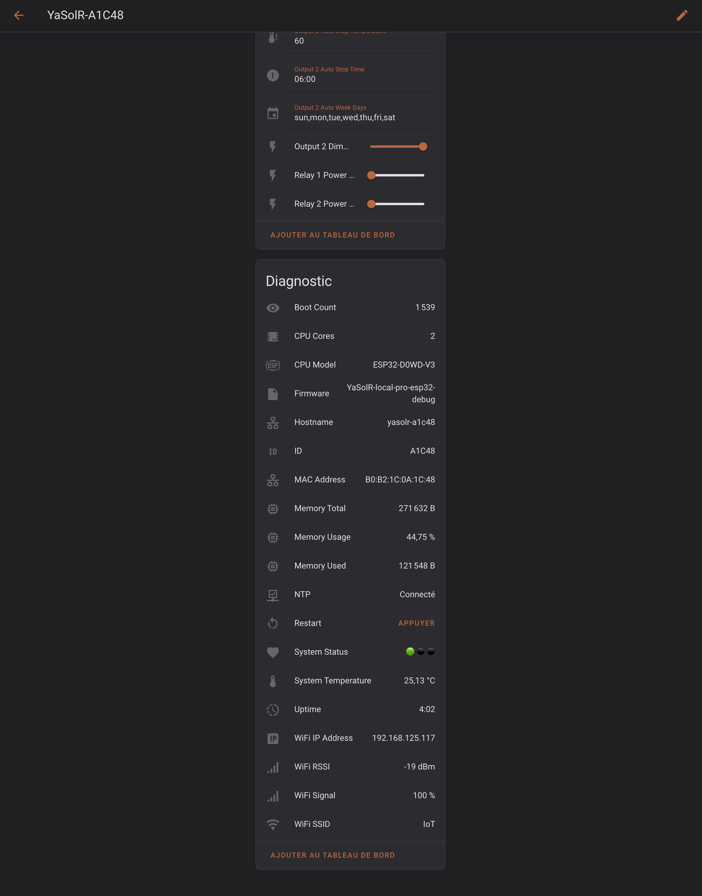](assets/img/screenshots/ha_disco_3.jpeg) |

### Network configuration menu

[](assets/img/screenshots/network.jpeg)

The network configuration page allows you to configure the network-related settings of the router.

#### WiFi and access

They require a restart of the router if changed.

- `Hostname`: the hostname of the router. It is set by default to `yasolr-<ID>`.
  I strongly recommend to keep this default value. The ID won't change except if you change the ESP board.
- `WiFi SSID`: the Home WiFi SSID to connect to
- `WiFi Password`: the Home WiFi password to connect to
- `Admin Password`: the password used to access (there is no password by default):
  - Any Web page, including the [REST API](web.md)
  - The Access Point when activated
  - The Captive Portal when the router restarts and no WiFi is available
- `AP Mode`: whether to activate or not the Access Point mode: switching the button will immediately restart the router in AP mode or STA mode

#### Time settings

They are applied at runtime and do not need a restart.

- `NTP Server`: the NTP server to use to sync the time
- `Timezone`: the timezone to use for the router
- `Sync time with browser`: if the router does not have access to Internet or is not able to sync time, you can use this button to sync the time with your browser.

**Time synchronization is required for some features to work, like Auto Bypass, which is triggered based on time and day.**

### Output configuration menu

[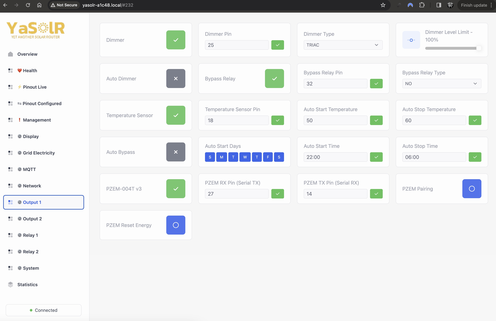](assets/img/screenshots/outputs.jpeg)

This section allows to configure the 2 outputs of the router. Each output is composed of:

- **A dimmer** (required): which is used to control the power sent to the resistive load
- **A temperature sensor** (optional): which is used to measure the temperature of the resistive load (i.e. water tank or heater) and automatically start the heating when needed
- **A bypass relay** (recommended): which is used to bypass the dimmer and send the full nominal power to the resistive load and avoid the dimmer to heat
- **A PZEM-004T v3** (recommended): which is used to monitor the power sent to the resistive load (one for each output) and allow to control the percentage of excess power assigned to each output

**Please note that if you do not install a bypass relay (or bypass relay is disabled), the dimmer will be used instead of it to send the full nominal power to the resistive load when needed.**

#### Dimmer

All these settings are applied at runtime and do not need a restart.

- `Output x Dimmer`: whether to activate or not the dimmer
- `Output x Dimmer Pin`: the pin used to control the dimmer (requires to disable and re-enable the dimmer)
- `Output x Dimmer Type`: the type of dimmer (triac based like Robodyn, Random SSR or Zero-Cross SSR). This will determine which algorithms can be used to control the dimmer.
- `Output x Auto Dimmer`: whether to activate or not the automatic routing.
  If activated, the router will automatically control the dimmer to send the required power to the resistive load based on the received Grid Power.
  It is possible to keep this setting disabled and control the dimmer manually or through REST API, MQTT or Home Assistant.
- `Output x Dimmer Level Limit`: the maximum level of the dimmer. This is used to limit the power sent to the resistive load.
  For example, if you set this value to `50%`, the dimmer jauge will never go more than 50%.
  **Please not that there is not a direct relationship between the dimmer level and the power sent to the resistive load!**.
  Although the implementation tries to do its best to theoretically match the output power, in practice, the power sent to the resistive load is not linear with the dimmer level.

**If the dimmer is deactivated, this is equivalent as disabling the whole output.**

#### Temperature Sensor

The temperature sensors is used to monitor the water tank but also to trigger an automatic heating based on temperature levels (called **auto bypass**).
All these settings are applied at runtime and do not need a restart.

- `Output x Temperature Sensor`: whether to activate or not the temperature sensor
- `Output x Temperature Sensor Pin`: the pin used to read the temperature sensor (requires to disable and re-enable the temperature sensor)

Supported temperature sensor: `DS18B20`

Changing one of these settings requires to disable and re-enable for the changes to be applied.

**If the temperature sensor is disabled or not working properly, the auto bypass mode will work but will not consider the temperature settings.**

#### ByPass Relay

All these settings are applied at runtime and do not need a restart.

- `Output x Bypass`: whether to activate or not the bypass relay if you have installed one. This is recommended to avoid the dimmer to heat too much when using auto bypass.
- `Output x Bypass Pin`: the pin used to control the bypass relay (requires to disable and re-enable the bypass relay)
- `Output x Bypass Type`: the type of bypass relay (Normally Open or Normally Closed)

#### Auto Bypass

The `Auto Bypass` feature will automatically start the heating depending on some rules: days, hours and temperature, if the temperature sensor is installed.
If not, temperature settings will be ignored.
If a relay is not present, the router will use the dimmer instead and set it to 100%.

**Warning:** If you do not install a relay and the dimmer is used instead, the power sent to to the resistive load when auto bypass is activated will count as routed power and energy.

- `Output x Auto Bypass`: whether to activate or not the automatic bypass.
  If activated, the router will automatically activate the bypass relay based on the configured rules.
  It is possible to keep this setting disabled and control the bypass relay manually or through REST API, MQTT or Home Assistant.
- `Output x Auto Start Days`: The days of the week when the auto bypass will be able to start.
- `Output x Auto Start Time`: The time of day when the auto bypass will start.
- `Output x Auto Stop Time`: The time of day when the auto bypass will stop.
- `Output x Auto Start Temperature`: The temperature threshold when the auto bypass will start: the temperature of the water tank needs to be lower than this threshold.
- `Output x Auto Stop Temperature`: The temperature threshold when the auto bypass will stop: the temperature of the water tank needs to be higher than this threshold.

Note that the auto bypass will only work if the time can be synchronized.

If the relay is deactivated or not installed, the dimmer will be used instead and will be set at full power.

#### Output Power Monitoring with PZEM-004T V3

Each output supports the addition of a PZEM-004T v3 sensor to monitor the power sent to the resistive load specifically for this output.
This also unlocks some additional features such as independent outputs and the ability to balance the excess power between outputs.

Thanks to the PZEM per output, it is also possible to get some more precise information like the dimmed RMS voltage, resistance value, etc.

- `PZEM-004T v3`: activate or not the PZEM-004T v3 for this output
- `RX / TX`: pin mapping for the PZEM-004T v3. It is the same for the 2 outputs.
- `PZEM Pairing`: starts the pairing procedure
- `PZEM Reset Energy`: reset energy data stored in the PZEM-004T v3

**Pairing procedure**

The PZEM-004T v3 devices has a special installation mode: you can install 2 PZEM-004T v3 devices on the same Serial TX/RX.
To communicate with the right one, each output will use a different slave address.
The initial setup requires to pair each PZEM-004T v3 with the corresponding output.

1. Connect the 2 PZEM-004T v3 devices to the grid (L/N) and install the clamp around the wire at the exit of the dimmer of first output
2. Only connect the terminal wire (+5V, GND, RX, TX) of the first PZEM-004T v3 to pair to Output 1
3. Boot the ESP32 wit the router firmware
4. Press the `PZEM Pairing` button in the `Output 1` menu
5. Verify that the pairing is successful
6. Disconnect the PZEM-004T v3 from the ESP32
7. Connect the second PZEM (which has its clamp at the exit of the dimmer of teh second output) to the ESP32
8. Press the `PZEM Pairing` button in the `Output 2` menu this time
9. Verify that the pairing is successful
10. Now connect the 2 PZEM-004T v3 devices to the ESP32

You can verify that the pairing is successful by:

- Trying to activate the dimmer in the overview page, and see if you get the output power
- Checking if you have any error in the `Health` menu
- Checking the confirmation logs in the Web Console at `http://yasolr-vwxyz.local/console`.
- Checking the REST API at `http://yasolr-vwxyz.local/api/router/`. You should see a json similar to this one, with `enabled` set to true, a non-zero `frequency` and a `voltage`:

```json
"pzem": {
  "address": 1,
  "current": 0,
  "enabled": true,
  "energy": 0.005,
  "frequency": 50,
  "power_factor": 0,
  "power": 0,
  "voltage": 234.3999939,
  "time": 2364846
}
```

Note: this complex pairing procedure is not specific to this router project but is common to any PZEM-004T device when using several PZEM-004T v3 devices on the same Serial TX/RX.
You can read more at:

- [mathieucarbou/MycilaPZEM004Tv3](https://github.com/mathieucarbou/MycilaPZEM004Tv3) (mandulaj's fork used by this project)
- [mandulaj/PZEM-004T-v30](https://github.com/mandulaj/PZEM-004T-v30)

### Relay configuration menu

[](assets/img/screenshots/relays.jpeg)

YaS☀️lR supports 2 relays (Electromechanical or SSR, controlled with 3.3V DC) to control external loads, or to be connected to the A1 and A2 terminals of a power contactor.
The voltage is not dimmed: these are 2 normal relays.

All these settings are applied at runtime and do not need a restart.

- `Relay x`: whether to activate or not the relay
- `Relay x Pin`: the pin used to control the relay (requires to disable and re-enable the relay)
- `Relay x Type`: the type of relay (Normally Open or Normally Closed)
- `Relay x Threshold`: a value in Watts when to help decide when to turn on or off the relay, with a 20% tolerance for starting and 20% tolerance for stopping

**Rules for the threshold**

`Virtual Power` is calculated by the router as `Grid Power - Routed Power - Relay Threshold`.
This is the power that would be sent to the grid if the router was not routing any power to the resistive loads or no relay activated.
`Virtual Power` is negative on export and positive on import.

The relay will automatically start when `Virtual Power <= - (Relay Threshold + 20%)`.

The relay will automatically stop when `Virtual Power >= - (Relay Threshold - 20%)`.

Which means that for the `Relay Threshold` to work properly, it needs to consume a nearly constant power that is in the range `Relay Threshold +/- 20%`.

Relays will be started in order and stopped in reverse order.

Note: the relay tolerance is currently not flexible enough to cover all use cases and will be improved in the future.
There is also no way currently to ensure that the excess remained above this threshold for a specific duration.

**Example**

We have this relay: `Relay Threshold == 1000 W`, so a tolerance between `800 W - 1200 W`

- `Grid Power == 0 W`
- `Routing == 1000 W`

`Virtual Power == 0 - 1000 W = -1000 W` (since relay stopped). `-1000 W > - 1200 W` => relay will not start.

- `Grid Power == 0 W`
- `Routing == 1200 W`

`Virtual Power == 0 - 1200 W = -1200 W` (since relay stopped). `-1200 W <= - 1200 W` => relay will start!
At this point, the routing will decrease to 200 W if the appliance connected to the relay consumes 1000 W.

- `Grid Power == 0 W`
- `Routing == 200 W`

`Virtual Power == 0 - 200 W - 1000 W = -1200 W` (since relay is on). `-1200 W < - 800 W` => relay will not stop.

- `Grid Power == 0 W`
- `Routing == 0 W`

`Virtual Power == 0 - 0 W - 1000 W = -1000 W` (since relay is on). `-1000 W < - 800 W` => relay will not stop.

- `Grid Power == + 200 W`
- `Routing == 0 W`

`Virtual Power == 200 - 0 W - 1000 W = -800 W` (since relay is on). `-800 W >= - 1200 W` => relay will stop!

### System configuration menu

[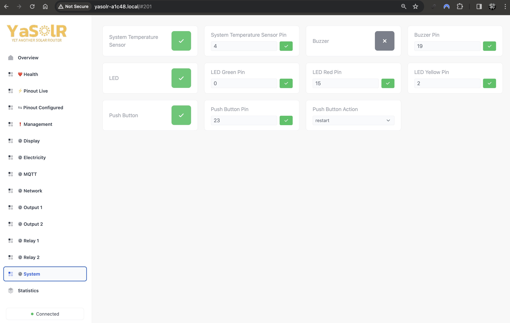](assets/img/screenshots/system.jpeg)

#### System temperature

- `System Temperature Sensor`: whether to activate or not the system temperature sensor
- `System Temperature Sensor Pin`: the pin used to read the system temperature sensor (requires to disable and re-enable the system temperature sensor)

Supported temperature sensor: `DS18B20`.

This sensor is optional and only used to monitor the temperature in the router box.

Changing one of these settings requires to disable and re-enable for the changes to be applied.

#### Buzzer

- `Buzzer`: whether to activate or not the buzzer
- `Buzzer Pin`: the pin used to control the buzzer (requires to disable and re-enable the buzzer)

The buzzer is used to emit sounds and beeps to notify the user of some events like reset, restarts, router ready, etc.

This sensor is optional.

Changing one of these settings requires to disable and re-enable for the changes to be applied.

#### LEDs

- `LEDs`: whether to activate or not the LEDs
- `LED Green Pin`: the pin used to control the Gren LED (requires to disable and re-enable the LEDs)
- `LED Yellow Pin`: the pin used to control the Yellow LED (requires to disable and re-enable the LEDs)
- `LED Red Pin`: the pin used to control the Red LED (requires to disable and re-enable the LEDs)

The LEDs are used to notify the user of some events like reset, restarts, router ready, routing, etc.

Changing one of these settings requires to disable and re-enable for the changes to be applied.

This sensor is optional.

| **LIGHTS** | **SOUNDS**       | **STATES**                       |
| :--------: | ---------------- | -------------------------------- |
| `🟢 🟡 🔴` | `BEEP BEEP`      | `STARTED` + `POWER` + `WIFI_OFF` |
| `🟢 🟡 ⚫` |                  | `STARTED` + `POWER`              |
| `🟢 ⚫ 🔴` | `BEEP BEEP`      | `STARTED` + `WIFI_OFF`           |
| `🟢 ⚫ ⚫` | `BEEP`           | `STARTED`                        |
| `⚫ 🟡 🔴` | `BEEP BEEP BEEP` | `RESET`                          |
| `⚫ 🟡 ⚫` |                  |                                  |
| `⚫ ⚫ 🔴` | `BEEP BEEP`      | `RESTART`                        |
| `⚫ ⚫ ⚫` |                  | `OFF`                            |

- `STARTED`: application started and WiFi or AP mode connected
- `WIFI_OFF`: application disconnected from WiFi
- `POWER`: power allowed to be sent (either through relays or dimmer)
- `RESTART`: application is restarting following a manual restart
- `RESET`: application is restarting following a manual reset
- `OFF`: application not working (power off)

#### Push Button

- `Push Button`: whether to activate or not the push button
- `Push Button Pin`: the pin used to read the push button (requires to disable and re-enable the push button)
- `Push Button Action`: the action to perform when the push button is pressed: `Reboot` or `Bypass`

This sensor is optional.

Changing one of these settings requires to disable and re-enable for the changes to be applied.

**When you activate the push button, a long press and hold for 10 seconds is always available and will do a factory reset.**

### Statistics page

| [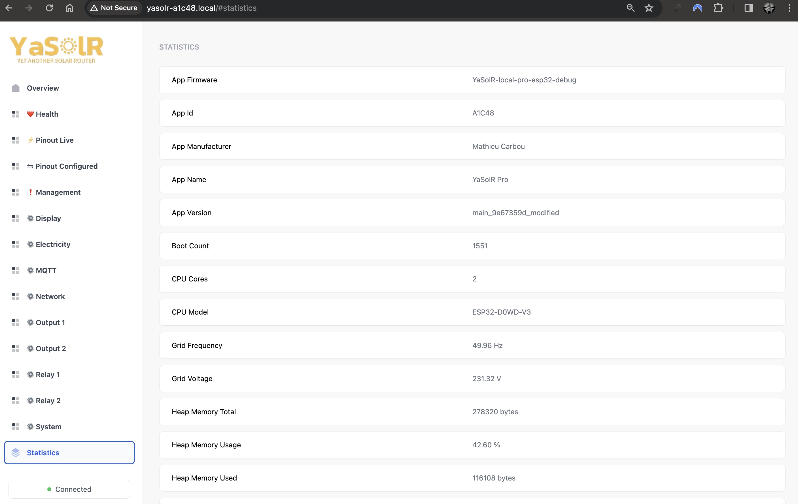](assets/img/screenshots/statistics1.jpeg) | [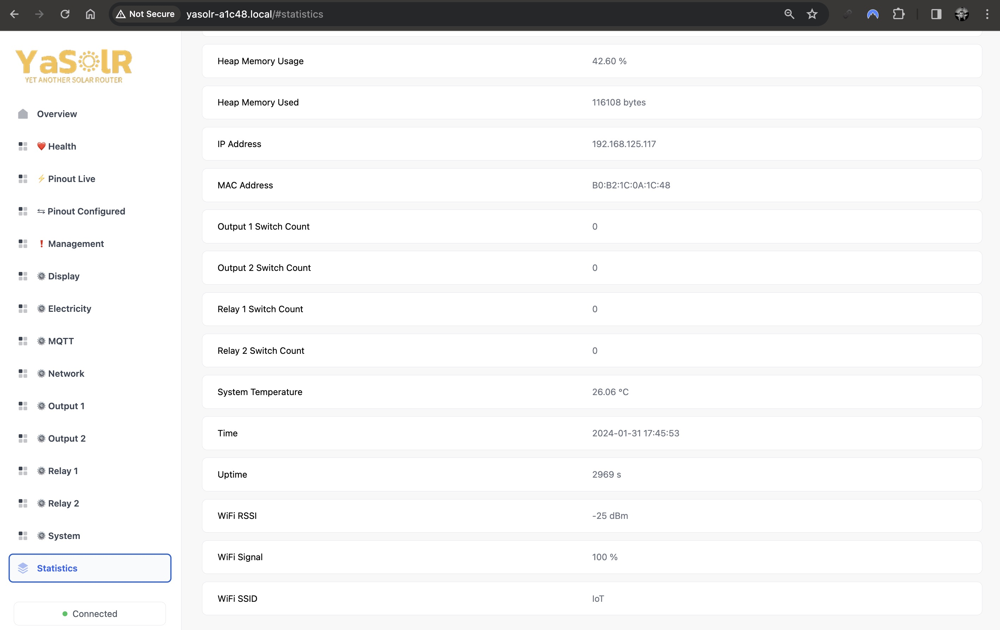](assets/img/screenshots/statistics2.jpeg) |

This page shows a lot of statistics and information on the router. Amongst them you will find:

- `Uptime`: the time since the router has been started
- `Heap Memory *`: information about the memory usage of the router
- `IP Address`
- `Grid Voltage`: the grid voltage measured by the JSY
- `Grid Frequency`: the grid frequency measured by the JSY or ZCD
- `System Temperature`: the temperature measured by the system temperature sensor
- `Time`: the current time once it is synced
- `WiFi RSSI` and `WiFi Signal`: the WiFi signal quality

### Configuration Debug page

This page is accessible at: `http://<esp-ip>/config`.
It allows to see the raw current configuration of the router and edit it.
This page should not normally be used, except for debugging purposes.

[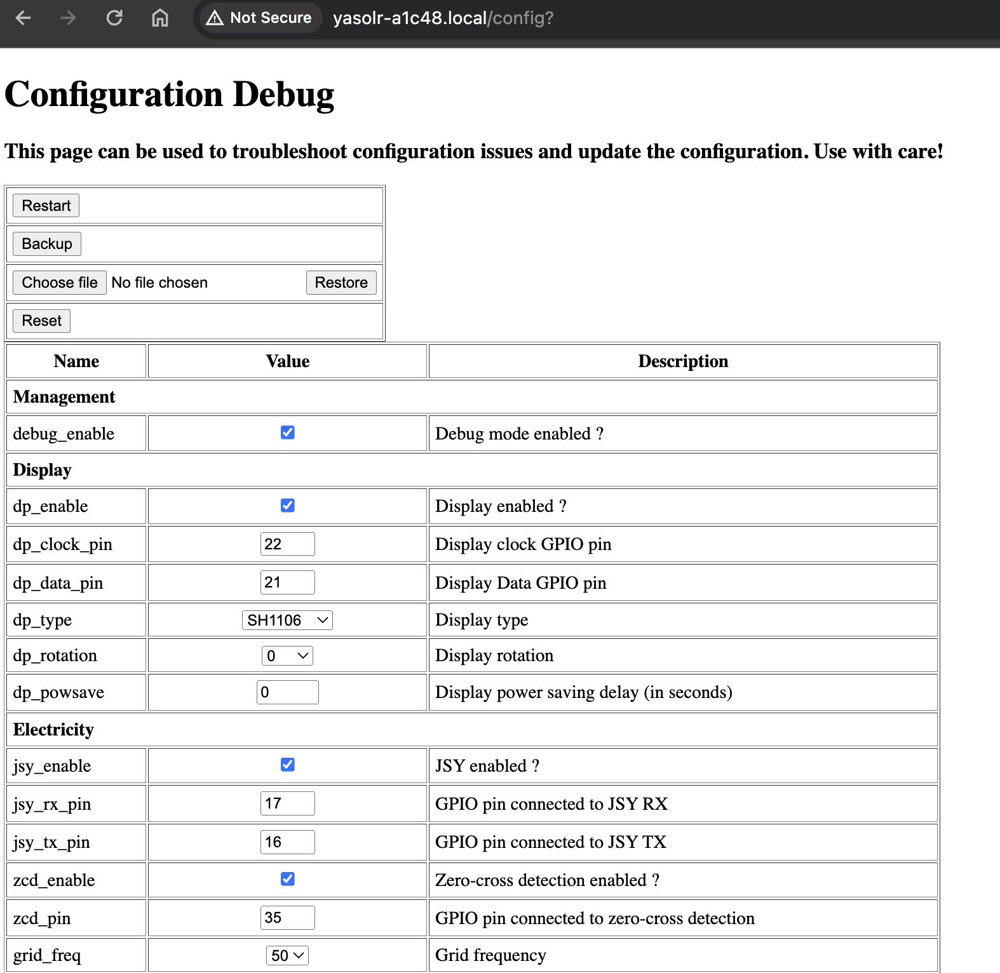](assets/img/screenshots/config-debug.jpeg)

### Web Console page

A Web Console is accessible at: `http://<esp-ip>/console`.
You can see more logs if you activate Debug logging (but it will make the router react a bit more slowly).

[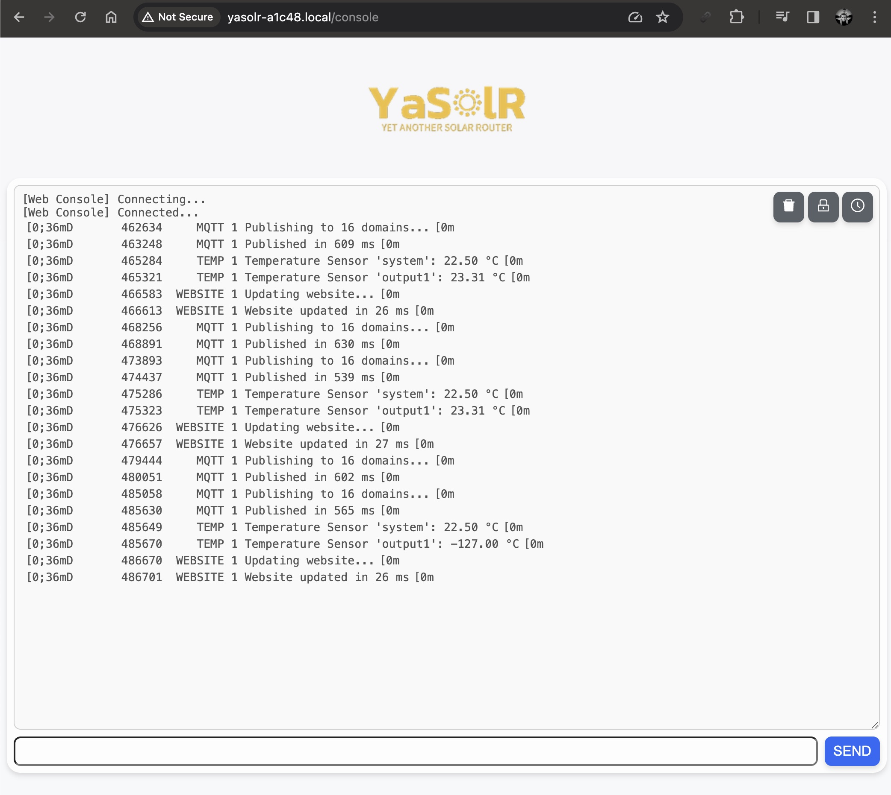](assets/img/screenshots/Web_Console.jpeg)

### Web OTA page

This page allows to update the firmware over the air:

- Go to the Web OTA at `http://<esp-ip>/update`

[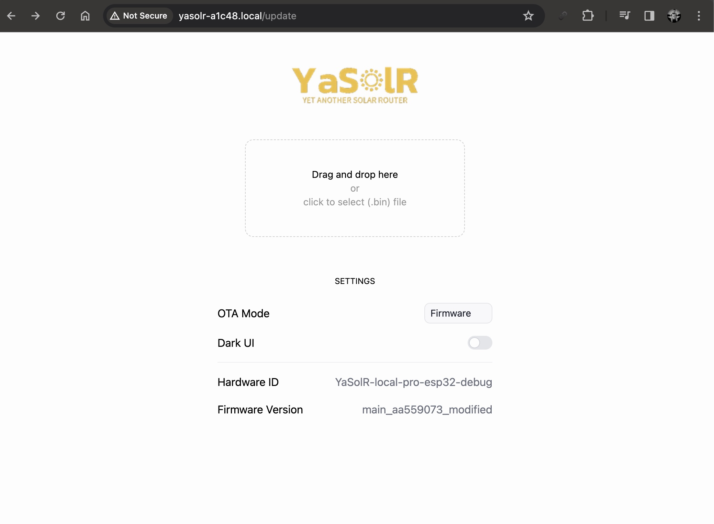](assets/img/screenshots/Web_OTA.jpeg)

The official ESP OTA at`<hostname>:3232` is also available.

## Help and support

- **Facebook Group**: [https://www.facebook.com/groups/yasolr](https://www.facebook.com/groups/yasolr)

- **GitHub Discussions**: [https://github.com/mathieucarbou/YaSolR-OSS/discussions](https://github.com/mathieucarbou/YaSolR-OSS/discussions)

- **GitHub Issues**: [https://github.com/mathieucarbou/YaSolR-OSS/issues](https://github.com/mathieucarbou/YaSolR-OSS/issues)
