# Overview

- [How routers work ?](#how-routers-work-)
  - [Phase Control System](#phase-control-system)
  - [Burst Modulation](#burst-modulation)
- [Router Issues and Solutions](#router-issues-and-solutions)
  - [How to reduce harmonics ?](#how-to-reduce-harmonics-)
  - [What about the Burst method ?](#what-about-the-burst-fire-method-)
  - [References](#references)

## How routers work ?

To chose a good router, you need to know how they work.

Routers are using a Zero-Cross Detection system and Phase Control system (or Burst Mode) to control the voltage curve (or the average voltage) in order to reduce the voltage and send a reduced power to the resistance, and then consequently prevent the Linky from recording a consumption more than what the solar excess is.
Depending on how the router is built, this dimmer system can be done in a different ways and with different hardware.

### Phase Control System

This method can use a TRIAC-based device to chop the voltage curve to reduce the voltage and consequently the power.
Phase Control System can be achieved for example with:

1. Robodyn AC Dimmer: a component able to do both ZCD and PC
2. Zero-Cross Detection circuit (ZCD) + Random Solid State Relay: a fast switching relay which is able to do PC

They can both chop the voltage curve by letting the load pass at a specific time.

The ZCD circuit is able to detect when the voltage curve crosses the Zero point.
Here is an oscilloscope view of how a ZCD circuit works:

|                                  **Dedicated ZCD circuit**                                   |                                           **Robodyn ZCD circuit**                                            |
| :------------------------------------------------------------------------------------------: | :----------------------------------------------------------------------------------------------------------: |
| [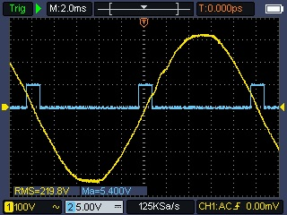](assets/img/measurements/Oscillo_ZCD.jpeg) | [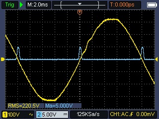](assets/img/measurements/Oscillo_ZCD_Robodyn.jpeg) |

When the AC voltage curve crosses the Zero point, the ZCD circuit sends a +5V pulse (assuming it is powered with 5V DC) for about 1 millisecond.
Thanks to this pulse, we can decide to activate the Phase Control system at the right moment depending on the wanted power.

Here are 3 different views from an oscilloscope of the voltage and current curve at the dimmer output, when using a Robodyn AC Dimmer set at 20%, 50%, 80%, and at full power (without dimmer), for a nominal resistive load of 600W:

|                                                     **20%**                                                      |                                                     **50%**                                                      |
| :--------------------------------------------------------------------------------------------------------------: | :--------------------------------------------------------------------------------------------------------------: |
| [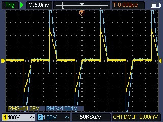](assets/img/measurements/Oscillo_Dimmer_20.jpeg) | [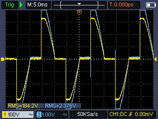](assets/img/measurements/Oscillo_Dimmer_50.jpeg) |
|                                                     **80%**                                                      |                                                **100% (Bypass)**                                                 |
| [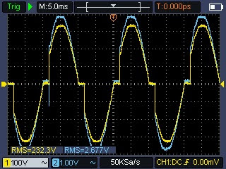](assets/img/measurements/Oscillo_Dimmer_80.jpeg) |  [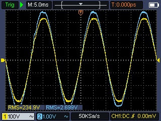](assets/img/measurements/Oscillo_Bypass.jpeg)   |

We can see the effect of the TRIAC on the voltage curve, and the resulting current curve, which is chopped at the wanted level.
A TRIAC is like a switch that can be opened and closed at a specific moment of the voltage curve, thus reducing the **consumed power**.

Now, let's see the effect of the TRIAC on the voltage and current curves, both at the output of the dimmer, and at the input of the router:

|                                                **Image**                                                | **Description**                                                                                |
| :-----------------------------------------------------------------------------------------------------: | :--------------------------------------------------------------------------------------------- |
|   [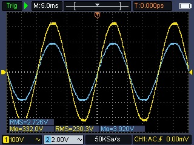](assets/img/measurements/Oscillo_600W_Out.jpeg)   | At Router output, no dimmer involved, full nominal power of ~600W (230V, 2.7A)                 |
| [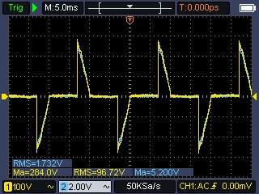](assets/img/measurements/Oscillo_Dim_20_Out.jpeg) | At Router output, dimmer set at 20%, ~160W (97V, 1.7A). Current curve hidden by voltage curve. |
|  [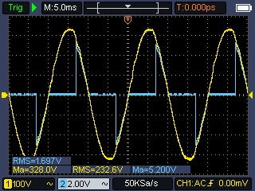](assets/img/measurements/Oscillo_Dim_20_In.jpeg)  | At Router input, dimmer set at 20%, current at ~1.7A, voltage is normal                        |

**Hardware used for measurement:**

All measures are done with the Owon HDS2202S portable oscilloscope with a 10x probe (yellow curve) and the Owon CP024 current clamp (100mV/A) to measure the current (blue curve).
The resolution of portable oscilloscopes is not as good as a lab oscilloscope, so the RMS values is not highly accurate, but the curves and values are good enough to see the effect of the TRIAC.

### Burst Modulation

Burst modulation will let a complete or half complete voltage curve pass or not, and this control is done at the zero point.
50Hz current has a voltage curve with a period of 20 ms decoupled in 2 half-periods: one positive, one negative, so the zero voltage is crossed twice per period.
So during 1 second, there are 100 half-periods which can be "turned" on and off.

This method can use a simple Zero-Cross Solid State Relay: a relay that will only close or open when the voltage curve is at 0.
So there is no load at that time of switching.
Switching at Zero-Cross point is clean because it does not cause harmonic and is recommended for a resistive load.
Several methods could be used: burst mode (we allow complete periods per burst), or some more customized method.

The goal is to beat the grid utility meter so that it does not record any excess or consumption.
For example, the Linky is looking at the voltage curve each 20 ms but is doing an aggregation over a longer duration of 1 second.
In order to beat the Linky, we allow within this window a correct sequence of half periods so that the Linky does not record any Watt (in consumption or excess), or just a few.

Here is an example of what [Clyric's router is doing](https://forum-photovoltaique.fr/viewtopic.php?f=110&t=60521&sid=070e622505fde923ce7f46235f38b8ba&start=120):

Burst mode (20% and 50%) at the top and an adapted version from Clyric at the bottom:

|     |                     Burst mode                     |                   Clyric's version                   |
| :-- | :------------------------------------------------: | :--------------------------------------------------: |
| 20% | 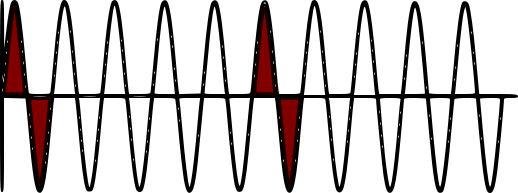 | 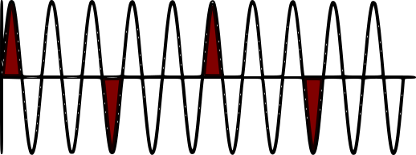 |
| 50% | 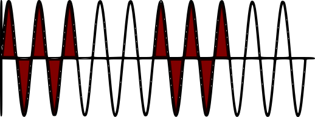 | 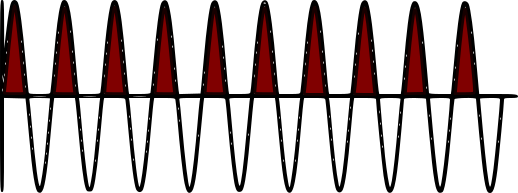 |

**References:**

- [Sorties de télé-information client des appareils de comptage Linky utilisés en généralisation par Enedis](https://www.enedis.fr/media/2035/download)
- [Routeur > Pilotage du SSR, angle ou train ?](https://forum-photovoltaique.fr/viewtopic.php?f=110&t=52707&p=590237&hilit=découpage+par+train+d%27onde)

## Router Issues and Solutions

The biggest issue with routers is **harmonics**, when using a Phase Control system that is chopping the voltage curve.
Chopping the voltage curve by allowing a current at a specific duration creates some harmonics which can impact other appliances if not filtered.
These harmonics gets bigger when the Phase Control system activates with a higher load.
And filtering these harmonics for such use is difficult so most entry price commercial routers do not even filter them out.
Harmonics generated by a solar router is not dangerous up to a certain level where it can impact or even damage other appliances, typically those which are more sensitive like inductive loads (motors), UPS, devices with clocks bases on voltage frequency, electronic devices like EV car charger, etc.

Eddi from Myenergi and Fronius Ohmpilot are more expensive commercial routers which include some filters.

_Harmonic examples:_

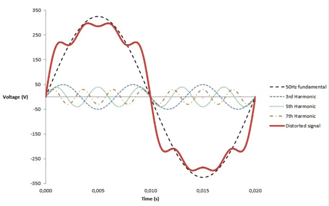

### How to reduce harmonics ?

According to [EN 61000-3-2](http://crochet.david.online.fr/bep/copie%20serveur/Normes/cei%2061000-3-2.pdf), a Solar Router is a Class A device because the dimmer is not integrated inside (the resistance is in the water tank).
We can read in [the study below](https://www.thierry-lequeu.fr/data/TRIAC.pdf), page 5, that a Class A device for resistive load that is dimmed should be **limited at around 750W in order to keep harmonics at a level accepted by the regulation when de Triac is at 90 degrees, so a load less than 1500 W**.

Here are the things you can do to optimize your installation and reduce the effects of harmonics:

**Installation and wiring:**

- Reduce the cable length between the router and the resistance to the bare minimum (a few meters) and use wider cables

- Put your router and resistance circuit as close as possible to the grid entrance and exit

- Connect the router to a more powerful resistance (in ohms - so less powerful in power) in order to decrease the current load.
  Let's compare how the voltage is dimmed for 2 resistances:

  - Resistance 1: 3000 W, 18 ohms => for 1000 W of excess, the dimmer will reduce the voltage to 134V and the load current will be 7.4A
  - Resistance 2: 1000 W, 53 ohms => for 1000 W of excess, the dimmer will activate at the voltage peak 230V (so higher) but the load current will only be 4.3A

- Switch the resistance to a tri-phase resistance in order to be able to control 3 resistances in steps independently: they will be activated step by step. Example:
  - Resistance 1: 700 W connected to the dimmer: the dimmer will route the solar excess from 0 to 700 W to this resistance
  - Resistance 2: 700 W connected to relay 1: when the excess is above 700 W, the relay will activate (all or nothing relay) and the second resistance will receive 700 W of excess.
    The first resistance connected to the Phase Control system (dimmer or Random SSR) will receive what is remaining from the excess.
  - Resistance 2: 700 W connected to relay 2: will work the same and will be activated when the excess will be above 700W.
- Only if required: try put an RC Snubber matching your TRIAC and load spec around the TRIAC (phase and load).
  It won't solve the harmonic issue but can help mitigate equipments sensible to voltage spikes.
  For example, the Robodyn AC Dimmer is NOT _"Snubberless"_ because it does not include an RC Snubber circuit.
  The TRIAC inside is a BTA16-600B or BTA24-600B or BTA40/BTA41.
  Suggestions often seen are to use a 100 ohms 0.1uF (100nF) RC Snubber (like the ones sold for Shelly's).

**Routing configuration:**

- Limit the routing power to be compliant with the regulation of harmonics (around 750W when de Triac is at 90 degrees, so a load less than 1500 W)

**In any case: try to route as little power as possible, use steps, and make sure the router does not have any priority over the other appliances.**

### What about the Burst method ?

When using a a Burst Fire Control, there is no harmonic issue (or really minimal ones at higher frequencies).
The problem is that it can allow too much load to pass at high power and at the opposite can open the relay for a long time, which will create some excess.
For this system to work properly, it needs to know how the utility meter is working internally in order to beat it, if it can.

It has some limitations:

- The linky sees what is happening within 20 ms so this method is less accurate to prevent readings from high loads from the Linky.
- So when the resistance power is too big, this method may not work well (linked to the fact above).
- Due to the fact that there are a lot of high power / no power successions, it could cause flickering.
- It is not perfect and will allow some consumption and excess
- No harmonics created in the sane way as a Phase Control system but still a little at higher frequencies
- When controlling on half waves, one caveat is that at around 50% (so when the excess power equals half the resistive nominal load) it can create for a short time of less then ~1 second a continuous component on the AC current since a sequence of half-periods will be allowed one time positive, next time negative.

## References

- **Some theory on Harmonics**

  - [Cos Phi vs Facteur Puissance](https://www.a-eberle.de/fr/rapports-dapplication/cos-phi-vs-facteur-de-puissance-pratique/)
  - [Détection et atténuation des harmoniques](https://fr.electrical-installation.org/frwiki/Détection_et_atténuation_des_harmoniques)
  - [Etude des harmoniques du courant de ligne](https://www.thierry-lequeu.fr/data/TRIAC.pdf)
  - [HARMONICS: CAUSES, EFFECTS AND MINIMIZATION](https://www.salicru.com/files/pagina/72/278/jn004a01_whitepaper-armonics_%281%29.pdf)
  - [HARMONIQUES ET DEPOLLUTION DU RESEAU ELECTRIQUE](http://archives.univ-biskra.dz/bitstream/123456789/21913/1/BELHADJ%20KHEIRA%20ET%20BOUZIR%20NESSRINE.pdf)
  - [Impact de la pollution harmonique sur les matériels de réseau](https://theses.hal.science/tel-00441877/document)
  - [Indicateur de distorsion harmonique : facteur de puissance](https://fr.electrical-installation.org/frwiki/Indicateur_de_distorsion_harmonique_:_facteur_de_puissance)
  - [La Compatibilité électromagnétque](https://www.captronic.fr/docrestreint.api/2404/4e754e58bf581845adc38b0122f9ff179618f2ba/pdf/APRIMA_-_CEM_2014-03-27.pdf)
  - [Les harmoniques: à l’origine des perturbations sur le réseau électrique](https://blog.materielelectrique.com/harmoniques-reseau-electrique/)
  - [Learn: PV Diversion](https://docs.openenergymonitor.org/pv-diversion/)
  - [Taux de distorsion harmonique](https://f1atb.fr/index.php/fr/2022/12/03/realisez-un-routeur-solaire-pour-gerer-la-surproduction/)

- **Some theory on TRIAC**

  - [BTA24-600B](https://html.alldatasheet.fr/html-pdf/447093/TGS/BTA24-600B/57/1/BTA24-600B.html)
  - [NEW TRIACS: IS THE SNUBBER CIRCUIT NECESSARY?](https://www.thierry-lequeu.fr/data/AN437.pdf)
  - [Le triac](https://emrecmic.wordpress.com/2017/02/07/le-triac/)
  - [Switching High Current Loads using a Triac](https://docs.openenergymonitor.org/pv-diversion/mk2/index.html#switching-high-current-loads-using-a-triac)
  - [Why Do Triacs In A Circuit Create Flickering Or Noise In The Load, And How To Minimise It?](https://www.electronicsforu.com/technology-trends/learn-electronics/triac-circuit-noise-minimisation)
  - [Routeur photovoltaïque – Modes de régulation](https://f1atb.fr/fr/routeur-photovoltaique-modes-de-regulation/)

- **Great forums discussions**

  - [probleme routeur tignous](https://forum-photovoltaique.fr/viewtopic.php?t=59389)
  - [Router via TRIAC et "Pollution" du réseau](https://forum-photovoltaique.fr/viewtopic.php?t=60521)

- **Videos** on routers from [Pierre Chfd (Professeur agrégé en sciences industrielles de l’ingénieur)](https://www.youtube.com/@pierrecfd7953/videos)

  - [1. Le problème, commande en tout ou rien](https://www.youtube.com/watch?v=guhyuWcfW7s)
  - [2. Fonctionnement du gradateur à angle de phase pour un routeur solaire](https://www.youtube.com/watch?v=uV1YzIjNjCw&t=922s)
  - [3. Pollution harmonique, puissance déformante](https://www.youtube.com/watch?v=nOtegLh8FWM)
  - [4. Simulation PSIM d'un routeur solaire](https://www.youtube.com/watch?v=ZBfgWbuQ2fU)
  - [5. Les solutions passives pour remédier aux problèmes générés par le gradateur à angle de phase](https://www.youtube.com/watch?v=RFmUVJ6Woy4)
  - [6. Les pertes dans le Triac et un compensateur actif](https://www.youtube.com/watch?v=9WDoFseLwlc)
  - [7. Retour sur la pollution réseau et le facteur de puissance. Le ballon ECS, qu'est-ce qu'il se passe ? Les routeurs à étage](https://www.youtube.com/watch?v=R4T-OdMP5CY)
  - [8. On étudie le facteur de puissance de ces routeurs et leur plage de fonctionnement à Fp sup à 0,9](https://www.youtube.com/watch?v=t5PY2yAfOGA)
  - [9. Diverses solutions, plus ou moins académiques](https://www.youtube.com/watch?v=6glCAdKCksY)

- **Videos** on routers (Guillaume Piton)

  - [1/2 Harmoniques & Routeur solaire](https://www.youtube.com/watch?v=HgK7U0dq4TM&t)
  - [2/2 Harmoniques & Routeur solaire](https://www.youtube.com/watch?v=goC25g7nwM0)

- **EMI Filters**

  - [Calculateur de filtre passe-bas/passe-haut](https://www.digikey.fr/fr/resources/conversion-calculators/conversion-calculator-low-pass-and-high-pass-filter)
  - [EMI Filtering: How to Suppress Triacs EMI and RFI Noise](https://passive-components.eu/how-to-suppress-triacs-emi-and-rfi-noise/)
  - [Filtrage (anti-parasitage) pour montages à triac](https://sonelec-musique.com/electronique_realisations_triac_filtres.html)

- **RC Snubbers**

  - [DESIGN OF SNUBBERS FOR POWER CIRCUITS](https://www.cde.com/resources/technical-papers/design.pdf)
  - [How can I determine the Resistance and capacitance value in a snubber circuit](https://forum.allaboutcircuits.com/threads/how-can-i-determine-the-resistanc-and-capacitance-value-in-a-snubber-circuit.179111/)
  - [How to calculate snubber value for triac](https://electronics.stackexchange.com/questions/285826/how-to-calculate-snubber-value-for-triac)
  - [rc snubber protection triac](https://www.youtube.com/watch?v=eveNh8XC98U)
